# DDD Bounded Context Design – CAB System

> **Repository tham chiếu:** https://github.com/ggiathinh65-debug/23671881_VuGiaThinh_Cabsystem  
> **Snapshot phân tích:** 23/09/2026  
> **Phạm vi:** Thiết kế Domain-Driven Design (DDD), Bounded Context, Context Map, Ubiquitous Language, Aggregate, Entity, Value Object, Command, Domain Event và cấu trúc thư mục đề xuất cho CAB System.

---

## 1. Mục đích tài liệu

Tài liệu này chuyển đặc tả nghiệp vụ hiện tại của CAB System sang kiến trúc **Domain-Driven Design**. Mục tiêu chính là:

- Xác định các **Bounded Context** có ranh giới nghiệp vụ rõ ràng.
- Mỗi Bounded Context có **Ubiquitous Language riêng**, tức là cùng một từ có thể mang nghĩa khác nhau ở context khác và không ép dùng chung một domain model.
- Xác định Aggregate, Entity, Value Object và các quy tắc bất biến chính.
- Xác định cách các context giao tiếp với nhau bằng Command, Domain Event và Integration Event.
- Ngăn việc dùng chung database/table/entity giữa các context.
- Tạo cấu trúc DDD có thể triển khai dưới dạng Modular Monolith trước hoặc tách Microservices sau.

### 1.1. Lưu ý về repository hiện tại

Repository hiện tại chủ yếu chứa `README.md` và `srs.md`; `srs.md` là tài liệu đặc tả nghiệp vụ chính. Vì vậy, phần dưới đây là **kiến trúc DDD đề xuất từ nghiệp vụ hiện có**, không giả định rằng đã có source code backend tương ứng.

---

# 2. Phạm vi nghiệp vụ hiện tại

CAB System hiện mô tả quy trình chính:

`Đăng nhập → Nhập điểm đón/điểm đến → Tìm tài xế → Phân công → Tài xế nhận chuyến → Thực hiện chuyến → Theo dõi → Hoàn thành → Tính cước → Thanh toán → Đánh giá`

Các nghiệp vụ chính trong SRS gồm:

- Quản lý tài khoản.
- Đặt xe.
- Xác định điểm đón/điểm đến.
- Tìm và phân công tài xế.
- Theo dõi trạng thái và vị trí chuyến.
- Quản lý hồ sơ tài xế và phương tiện.
- Cập nhật trạng thái tài xế.
- Tính cước và thanh toán.
- Thông báo.
- Đánh giá tài xế.
- Vận hành, tra cứu giao dịch và báo cáo.

SRS cũng quy định một số luật quan trọng: chỉ tài xế ở trạng thái sẵn sàng mới nhận chuyến; tài xế từ chối/không phản hồi thì hệ thống tìm tài xế khác; không tìm thấy tài xế phải báo khách hàng; trạng thái chuyến phải đi theo trình tự; chỉ chuyến đã hoàn thành mới được thanh toán/đánh giá theo luồng nghiệp vụ tương ứng.

---

# 3. Nguyên tắc chia Bounded Context

Việc chia context không dựa đơn thuần vào số lượng Use Case. Một context được tạo khi nó có:

1. **Một mô hình nghiệp vụ riêng.**
2. **Một nhóm thuật ngữ có nghĩa ổn định trong phạm vi đó.**
3. **Các invariant cần bảo vệ riêng.**
4. **Một trách nhiệm nghiệp vụ tương đối độc lập.**
5. **Khả năng sở hữu dữ liệu riêng.**

### 3.1. Quy tắc Boundary

| Quy tắc | Thiết kế CAB |
|---|---|
| Một context có model riêng | `Trip` của Trip Execution không phải `Trip` của Reporting |
| Không dùng chung Entity | Customer Management không dùng trực tiếp entity `Driver` của Driver & Fleet |
| Không truy cập DB của context khác | Billing không đọc trực tiếp bảng `Trip` |
| Chỉ chia sẻ ID/Contract | Billing nhận `tripId`, `completedAt`, `distance` qua contract |
| Giao tiếp bằng API/Event | Command cho hành động cần phản hồi; Event cho thông báo đã xảy ra |
| Dữ liệu báo cáo là projection | Operations & Analytics không làm owner dữ liệu giao dịch gốc |
| External system đi qua Adapter/ACL | Payment Gateway và Notification Provider không xâm nhập domain model |
| Mỗi context có Ubiquitous Language riêng | `Trip`, `Assignment`, `Payment`, `Notification` không dùng lẫn nghĩa |

---

# 4. Tổng thể các Bounded Context

Đề xuất **10 Bounded Context**:

| BC | Tên | Vai trò | Loại |
|---|---|---|---|
| BC01 | Identity & Access | Đăng ký, đăng nhập, xác thực, phân quyền | Supporting |
| BC02 | Customer Management | Hồ sơ và thông tin khách hàng | Supporting/Core-adjacent |
| BC03 | Driver & Fleet | Hồ sơ tài xế, phương tiện, trạng thái sẵn sàng, vị trí hoạt động | Core |
| BC04 | Ride Booking | Tạo và quản lý yêu cầu đặt xe của khách | **Core** |
| BC05 | Dispatch | Tìm, chọn, mời và phân công tài xế | **Core** |
| BC06 | Trip Execution & Tracking | Vòng đời chuyến, trạng thái và theo dõi chuyến | **Core** |
| BC07 | Billing & Payment | Tính cước và ghi nhận thanh toán | Core |
| BC08 | Notification | Tạo và phân phối thông báo | Supporting |
| BC09 | Feedback & Rating | Đánh giá chất lượng chuyến/tài xế | Supporting |
| BC10 | Operations & Analytics | Vận hành và báo cáo | Supporting |

> **Ghi chú:** Có 10 context, trong đó 4–6 context tạo thành luồng Core Domain của CAB: **Ride Booking → Dispatch → Trip Execution**, được hỗ trợ bởi **Driver & Fleet** và **Billing & Payment**.

---

# 5. Context Map tổng thể

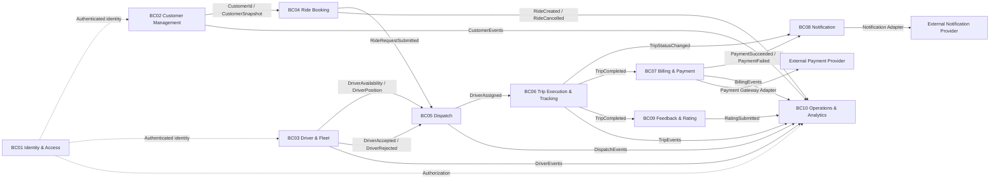

### 5.1. Luồng Core Domain

```text
Customer
   |
   v
Ride Booking
   |
   | RideRequestSubmitted
   v
Dispatch <------ Driver & Fleet
   |
   | DriverAssigned
   v
Trip Execution & Tracking
   |
   +---- TripCompleted ----> Billing & Payment ----> Payment Gateway
   |
   +---- TripCompleted ----> Feedback & Rating
   |
   +---- TripStatusChanged --> Notification
```

---

# 6. BC01 – Identity & Access Context

## 6.1. Boundary

Context này chỉ chịu trách nhiệm về **ai đang truy cập hệ thống và người đó được phép làm gì**. Nó không chịu trách nhiệm về khách hàng có đặt chuyến hay tài xế có nhận chuyến hay không.

### Không thuộc context này

- Giá cước.
- Chuyến xe.
- Trạng thái tài xế nghiệp vụ.
- Hồ sơ phương tiện.
- Đánh giá.

## 6.2. Ubiquitous Language riêng

| Thuật ngữ | Ý nghĩa trong context |
|---|---|
| `UserAccount` | Danh tính dùng để xác thực |
| `Credential` | Thông tin chứng thực |
| `Role` | Nhóm quyền của tài khoản |
| `Permission` | Quyền thao tác cụ thể |
| `Session` | Phiên đăng nhập |
| `Authenticate` | Xác minh thông tin đăng nhập |
| `Authorize` | Kiểm tra quyền thực hiện hành động |
| `DisableAccount` | Chặn tài khoản đăng nhập |

### Động từ hành vi

`register`, `authenticate`, `authorize`, `refreshSession`, `changeCredential`, `disableAccount`, `enableAccount`.

## 6.3. Aggregate

### `UserAccount` – Aggregate Root

Invariant chính:

- Username/email đăng nhập phải duy nhất.
- Tài khoản bị disable không thể tạo phiên đăng nhập mới.
- Role/Permission phải được kiểm tra trước thao tác được bảo vệ.

## 6.4. Value Objects

- `UserId`
- `Username`
- `PasswordHash`
- `RoleName`
- `PermissionCode`
- `SessionId`

## 6.5. Commands

- `RegisterUser`
- `AuthenticateUser`
- `RefreshSession`
- `ChangePassword`
- `AssignRole`
- `DisableUser`

## 6.6. Domain Events

- `UserRegistered`
- `UserAuthenticated`
- `RoleAssigned`
- `UserDisabled`

---

# 7. BC02 – Customer Management Context

## 7.1. Boundary

Context này sở hữu **hồ sơ nghiệp vụ của khách hàng**, không sở hữu credential đăng nhập.

## 7.2. Ubiquitous Language riêng

| Thuật ngữ | Ý nghĩa |
|---|---|
| `Customer` | Người sử dụng dịch vụ CAB với tư cách khách hàng |
| `CustomerProfile` | Hồ sơ nghiệp vụ của khách |
| `ContactInfo` | Thông tin liên hệ |
| `CustomerStatus` | Trạng thái nghiệp vụ của khách |
| `UpdateProfile` | Cập nhật hồ sơ khách hàng |
| `SuspendCustomer` | Tạm ngưng quyền sử dụng dịch vụ ở tầng nghiệp vụ |

### Động từ hành vi

`createProfile`, `updateProfile`, `viewProfile`, `suspendCustomer`, `restoreCustomer`.

## 7.3. Aggregate

### `Customer` – Aggregate Root

```text
Customer
 ├── CustomerId
 ├── UserId          <- ID từ Identity & Access, không phải entity dùng chung
 ├── FullName
 ├── ContactInfo
 └── CustomerStatus
```

Invariant:

- `Customer.UserId` tham chiếu identity hợp lệ.
- Customer bị suspend không được tạo hành động đặt xe mới.

## 7.4. Events

- `CustomerCreated`
- `CustomerProfileUpdated`
- `CustomerSuspended`
- `CustomerRestored`

---

# 8. BC03 – Driver & Fleet Context

## 8.1. Boundary

Context này quản lý **tài xế như một nguồn lực vận tải**, cùng phương tiện, trạng thái sẵn sàng và vị trí hoạt động.

Dispatch chỉ hỏi context này: "tài xế nào hiện có thể nhận chuyến và đang ở đâu?".

## 8.2. Ubiquitous Language riêng

| Thuật ngữ | Ý nghĩa trong Driver & Fleet |
|---|---|
| `Driver` | Hồ sơ tài xế và năng lực phục vụ |
| `Vehicle` | Phương tiện mà tài xế sử dụng |
| `Availability` | Khả năng nhận yêu cầu tại thời điểm hiện tại |
| `Online` | Tài xế đang kết nối/hoạt động |
| `Offline` | Không nhận yêu cầu |
| `Ready` | Đủ điều kiện nhận chuyến |
| `Busy` | Đang bận bởi chuyến/assignment |
| `DriverPosition` | Vị trí hoạt động gần nhất |

### Động từ hành vi

`goOnline`, `goOffline`, `becomeReady`, `becomeBusy`, `updatePosition`, `registerVehicle`, `updateVehicle`.

## 8.3. Aggregates

### `Driver` – Aggregate Root

Quản lý thông tin nghiệp vụ và phương tiện trực thuộc.

### `DriverAvailability` – Aggregate Root

Tách riêng để tránh làm aggregate `Driver` quá lớn khi trạng thái/vị trí cập nhật liên tục.

## 8.4. Value Objects

- `DriverId`
- `VehicleId`
- `VehicleType`
- `LicensePlate`
- `GeoCoordinate`
- `DriverStatus`

## 8.5. Invariants

- Chỉ `Ready` mới có thể được Dispatch mời nhận chuyến.
- Một tài xế không được nhận hai assignment đang hoạt động nếu business policy không cho phép.
- Vị trí phải có timestamp để Dispatch biết dữ liệu có còn mới hay không.

## 8.6. Events

- `DriverRegistered`
- `VehicleRegistered`
- `DriverBecameReady`
- `DriverBecameBusy`
- `DriverWentOffline`
- `DriverPositionUpdated`

---

# 9. BC04 – Ride Booking Context

## 9.1. Boundary

Đây là nơi **khách hàng tạo yêu cầu đi xe**. Context này không chịu trách nhiệm quyết định tài xế nào sẽ nhận chuyến.

## 9.2. Ubiquitous Language riêng

| Thuật ngữ | Ý nghĩa |
|---|---|
| `RideRequest` | Nhu cầu đi xe của khách |
| `Pickup` | Điểm đón |
| `Destination` | Điểm đến |
| `RideType` | Loại dịch vụ/loại xe khách chọn |
| `Requested` | Yêu cầu vừa được tạo |
| `Searching` | Yêu cầu đang chờ tìm tài xế |
| `Cancelled` | Khách đã hủy yêu cầu |
| `SubmitRideRequest` | Gửi nhu cầu đặt xe |

### Động từ hành vi

`requestRide`, `changeDestination`, `cancelRideRequest`, `confirmRideRequest`.

## 9.3. Aggregate

### `RideRequest` – Aggregate Root

```text
RideRequest
 ├── RideRequestId
 ├── CustomerId
 ├── Pickup : Location
 ├── Destination : Location
 ├── RideType
 ├── Status
 └── RequestedAt
```

### Value Objects

- `RideRequestId`
- `Location`
- `GeoCoordinate`
- `RideType`
- `RequestStatus`

## 9.4. Invariants

- Pickup và Destination phải tồn tại.
- Không thể cancel một request đã chuyển sang trạng thái không cho phép hủy.
- Customer bị suspend không được tạo request.

## 9.5. Commands

- `CreateRideRequest`
- `CancelRideRequest`
- `UpdateRideDestination`

## 9.6. Events

- `RideRequestSubmitted`
- `RideRequestCancelled`
- `RideRequestUpdated`

> `RideRequest` cố tình không chứa object `Driver`. Driver được chọn ở Dispatch Context.

---

# 10. BC05 – Dispatch Context

## 10.1. Boundary

Đây là **Core Domain quan trọng**: quyết định tìm ai, mời ai và khi nào assignment thành công.

Dispatch không sở hữu hồ sơ tài xế, không sở hữu thông tin đăng nhập và không sở hữu payment.

## 10.2. Ubiquitous Language riêng

| Thuật ngữ | Ý nghĩa trong Dispatch |
|---|---|
| `DispatchJob` | Công việc tìm tài xế cho một RideRequest |
| `Candidate` | Tài xế đủ điều kiện đang được xét |
| `MatchScore` | Điểm phù hợp của candidate |
| `AssignmentOffer` | Lời mời nhận chuyến gửi cho tài xế |
| `Accepted` | Tài xế chấp nhận offer |
| `Rejected` | Tài xế từ chối offer |
| `Expired` | Offer hết thời gian phản hồi |
| `NoDriverAvailable` | Không còn candidate phù hợp |

### Động từ hành vi

`startDispatch`, `findCandidates`, `rankCandidates`, `offerAssignment`, `acceptAssignment`, `rejectAssignment`, `expireOffer`, `retryDispatch`.

## 10.3. Aggregate

### `DispatchJob` – Aggregate Root

```text
DispatchJob
 ├── DispatchJobId
 ├── RideRequestId
 ├── CandidateSnapshot[]
 ├── CurrentOffer
 └── DispatchStatus
```

`CandidateSnapshot` chỉ là dữ liệu cần cho quyết định dispatch tại thời điểm đó; không phải Driver Entity từ BC03.

## 10.4. Domain Services

### `DriverMatchingService`

Nhận:

- Pickup location.
- Ride type.
- Driver availability snapshot.
- Driver position snapshot.

Trả về danh sách candidate đã xếp hạng.

Ví dụ policy:

```text
Candidate đủ điều kiện
    ↓
Lọc Ready
    ↓
Lọc VehicleType phù hợp
    ↓
Loại dữ liệu position quá cũ
    ↓
Tính khoảng cách
    ↓
Xếp hạng
    ↓
Offer cho candidate đầu tiên
```

## 10.5. Invariants

- Chỉ dispatch driver ở trạng thái phù hợp.
- Một `AssignmentOffer` có timeout.
- Reject/timeout → chuyển candidate tiếp theo.
- Không còn candidate → phát `DriverNotFoundForRide`.

## 10.6. Events

- `DispatchStarted`
- `DriverCandidateSelected`
- `AssignmentOffered`
- `AssignmentAccepted`
- `AssignmentRejected`
- `AssignmentExpired`
- `DriverAssigned`
- `NoDriverAvailable`

---

# 11. BC06 – Trip Execution & Tracking Context

## 11.1. Boundary

Context này quản lý **chuyến đã được tạo và đang được thực hiện**. Đây là nơi sở hữu state machine của Trip.

## 11.2. Ubiquitous Language riêng

| Thuật ngữ | Ý nghĩa |
|---|---|
| `Trip` | Chuyến đi đã được xác nhận/phân công |
| `Assigned` | Đã có tài xế |
| `DriverArriving` | Tài xế đang đến điểm đón |
| `Arrived` | Tài xế đã đến |
| `PassengerOnBoard` | Đã đón khách |
| `InProgress` | Đang di chuyển |
| `Completed` | Chuyến hoàn thành |
| `Cancelled` | Chuyến bị hủy |
| `TrackingPoint` | Điểm dữ liệu theo dõi vị trí |

### Động từ hành vi

`createTrip`, `markArrived`, `startTrip`, `updateTripPosition`, `completeTrip`, `cancelTrip`.

## 11.3. Aggregate

### `Trip` – Aggregate Root

```text
Trip
 ├── TripId
 ├── RideRequestId
 ├── CustomerId
 ├── DriverId
 ├── Pickup
 ├── Destination
 ├── TripStatus
 ├── StartedAt
 ├── CompletedAt
 └── Distance
```

`DriverId` và `CustomerId` là identifier tham chiếu, không phải foreign Entity của context khác.

## 11.4. State machine

```text
Assigned
   |
   v
DriverArriving
   |
   v
Arrived
   |
   v
PassengerOnBoard
   |
   v
InProgress
   |
   v
Completed
```

Các nhánh hủy phải tuân business policy của hệ thống.

## 11.5. Invariants

- Không thể `completeTrip()` khi trip chưa bắt đầu/không ở trạng thái cho phép.
- Không được nhảy trạng thái tùy ý.
- Chỉ driver đã được assignment mới có thể cập nhật trạng thái của trip.
- `CompletedAt` chỉ có khi trip chuyển thành `Completed`.

## 11.6. Events

- `TripCreated`
- `DriverArrived`
- `TripStarted`
- `TripStatusChanged`
- `TripPositionUpdated`
- `TripCompleted`
- `TripCancelled`

---

# 12. BC07 – Billing & Payment Context

## 12.1. Boundary

Context này chịu trách nhiệm **tính số tiền phải thu và quản lý giao dịch thanh toán**.

Không để Billing đọc trực tiếp bảng `Trip`.

## 12.2. Ubiquitous Language riêng

| Thuật ngữ | Ý nghĩa |
|---|---|
| `Fare` | Số tiền phải thu cho chuyến |
| `FareRule` | Chính sách tính cước |
| `FareBreakdown` | Cấu phần tạo nên giá |
| `PaymentIntent` | Yêu cầu thanh toán |
| `PaymentTransaction` | Giao dịch thanh toán |
| `Cash` | Thanh toán tiền mặt |
| `ElectronicPayment` | Thanh toán qua nhà cung cấp điện tử |
| `Succeeded` | Thanh toán thành công |
| `Failed` | Thanh toán thất bại |
| `Retry` | Thử thanh toán lại |

### Động từ hành vi

`calculateFare`, `createPaymentIntent`, `pay`, `confirmPayment`, `failPayment`, `retryPayment`, `refund` (nếu hệ thống mở rộng).

## 12.3. Aggregates

### `FareCalculation`

Đảm bảo kết quả tính cước nhất quán.

### `PaymentTransaction` – Aggregate Root

Quản lý vòng đời giao dịch.

## 12.4. Value Objects

- `Money`
- `Currency`
- `FareBreakdown`
- `PaymentMethod`
- `TransactionId`
- `PaymentStatus`

## 12.5. Invariants

- Không tạo payment cho Trip chưa hoàn thành nếu policy hiện tại yêu cầu hoàn thành trước.
- Amount không được âm.
- Một transaction đã `Succeeded` không được quay lại `Pending`.
- Payment Gateway response phải được kiểm tra idempotency.

## 12.6. External Adapter

```text
Billing Domain
    |
    v
PaymentGatewayPort
    |
    v
PaymentGatewayAdapter
    |
    v
External Payment Provider
```

## 12.7. Events

- `FareCalculated`
- `PaymentInitiated`
- `PaymentSucceeded`
- `PaymentFailed`
- `PaymentRetried`

---

# 13. BC08 – Notification Context

## 13.1. Boundary

Notification không quyết định nghiệp vụ. Nó chỉ biến **sự kiện nghiệp vụ thành thông báo tới người nhận**.

Ví dụ: Trip Context phát `TripCompleted`; Notification quyết định nội dung và kênh gửi theo notification policy.

## 13.2. Ubiquitous Language riêng

| Thuật ngữ | Ý nghĩa |
|---|---|
| `Recipient` | Người nhận |
| `Template` | Mẫu nội dung |
| `NotificationMessage` | Nội dung cần gửi |
| `Channel` | Push/SMS/Email/... |
| `DeliveryAttempt` | Một lần thử gửi |
| `Delivered` | Provider xác nhận đã gửi |
| `Failed` | Gửi thất bại |

### Động từ hành vi

`compose`, `schedule`, `send`, `retryDelivery`, `markDelivered`, `markFailed`.

## 13.3. Aggregate

### `Notification` – Aggregate Root

Không để Notification Entity biết `Trip` cụ thể là object nào. Nó chỉ nhận:

- recipientId
- eventType
- notification payload
- channel

## 13.4. Domain Events

- `NotificationCreated`
- `NotificationSent`
- `NotificationDeliveryFailed`

## 13.5. Anti-Corruption Layer

External Notification Provider được che bởi interface:

```text
NotificationApplicationService
        |
        v
NotificationProviderPort
        |
        v
Push/SMS/Email Adapter
```

---

# 14. BC09 – Feedback & Rating Context

## 14.1. Boundary

Context này quản lý **ý kiến đánh giá sau chuyến**. Rating không điều khiển Trip và không thay đổi trạng thái thanh toán.

## 14.2. Ubiquitous Language riêng

| Thuật ngữ | Ý nghĩa |
|---|---|
| `Rating` | Điểm đánh giá cho một trip |
| `Comment` | Nhận xét dạng văn bản |
| `ReviewEligibility` | Điều kiện được phép đánh giá |
| `Submitted` | Đã gửi đánh giá |
| `Edited` | Đã chỉnh sửa nếu policy cho phép |

### Động từ hành vi

`checkEligibility`, `submitRating`, `editRating`.

## 14.3. Aggregate

### `DriverRating` – Aggregate Root

```text
DriverRating
 ├── RatingId
 ├── TripId
 ├── CustomerId
 ├── DriverId
 ├── Score
 └── Comment
```

## 14.4. Invariants

- Trip phải ở trạng thái đủ điều kiện đánh giá.
- Mỗi Trip chỉ được đánh giá theo policy đã định.
- Score phải nằm trong miền giá trị được quy định.

## 14.5. Events

- `RatingSubmitted`
- `RatingUpdated`

---

# 15. BC10 – Operations & Analytics Context

## 15.1. Boundary

Context này phục vụ nhân viên vận hành và lãnh đạo bằng dữ liệu đã tổng hợp.

**Điểm quan trọng:** Operations & Analytics không trở thành “God Context” sở hữu Customer, Driver, Trip, Payment.

## 15.2. Ubiquitous Language riêng

| Thuật ngữ | Ý nghĩa |
|---|---|
| `OperationalCase` | Sự việc cần nhân viên xử lý |
| `TripIncident` | Sự cố liên quan đến chuyến |
| `TransactionHistory` | Lịch sử giao dịch đã phát sinh |
| `Metric` | Chỉ số đã tổng hợp |
| `Report` | Báo cáo theo khoảng thời gian |
| `Projection` | Read model được xây từ event |

### Động từ hành vi

`search`, `inspect`, `resolveIncident`, `queryHistory`, `generateReport`, `viewMetric`.

## 15.3. Data ownership

Operations **không sở hữu source of truth** của:

- Customer profile.
- Driver profile.
- Vehicle.
- Trip.
- Payment.
- Rating.

Nó sở hữu các projection phục vụ đọc nhanh:

```text
TripOpsProjection
DriverOpsProjection
PaymentOpsProjection
RevenueReportProjection
DriverPerformanceProjection
```

## 15.4. Event-driven read model

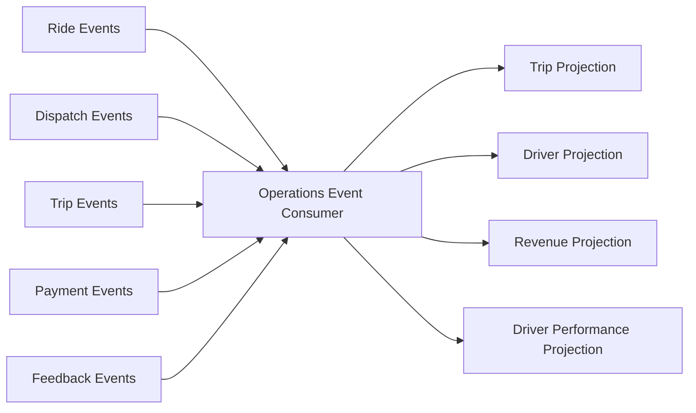

---

# 16. Ubiquitous Language không được dùng lẫn giữa các context

Đây là phần quan trọng nhất của **Boundary**.

| Từ | BC | Nghĩa |
|---|---|---|
| `Trip` | Trip Execution | Chuyến đang được thực hiện |
| `RideRequest` | Ride Booking | Nhu cầu khách vừa yêu cầu |
| `DispatchJob` | Dispatch | Công việc tìm tài xế |
| `AssignmentOffer` | Dispatch | Lời mời nhận chuyến |
| `Driver` | Driver & Fleet | Tài xế và trạng thái nguồn lực |
| `DriverSnapshot` | Dispatch | Bản chụp dữ liệu tài xế dùng cho quyết định matching |
| `PaymentTransaction` | Billing | Giao dịch thu tiền |
| `Notification` | Notification | Thông điệp cần gửi |
| `Rating` | Feedback | Đánh giá sau chuyến |
| `Metric` | Operations | Chỉ số tổng hợp |

### Ví dụ về nguyên tắc boundary

**Không làm:**

```text
DispatchService -> DriverEntity trực tiếp
BillingService -> TripEntity trực tiếp
ReportingService -> PaymentEntity trực tiếp
```

**Nên làm:**

```text
DispatchService
    -> DriverAvailabilityQuery
    -> DriverSnapshot

BillingService
    <- TripCompleted(tripId, distance, completedAt)

ReportingService
    <- Domain/Integration Events
    -> Projection
```

---

# 17. Context Relationship Map

| Upstream | Downstream | Quan hệ | Hình thức |
|---|---|---|---|
| Identity | Customer | Conformist/ID reference | UserId |
| Identity | Driver | Conformist/ID reference | UserId |
| Customer | Ride Booking | Customer provides identity/profile | API/Event |
| Driver & Fleet | Dispatch | Upstream cung cấp availability/position | Query/API/Event |
| Ride Booking | Dispatch | Ride yêu cầu dispatch | `RideRequestSubmitted` |
| Dispatch | Trip Execution | Assignment tạo trip | `DriverAssigned` |
| Trip Execution | Billing | Trip hoàn thành cần tính cước | `TripCompleted` |
| Trip Execution | Notification | Trạng thái trip cần thông báo | Event |
| Billing | Notification | Kết quả payment cần thông báo | Event |
| Trip Execution | Feedback | Trip completed mở quyền rating | Event |
| Tất cả Core Context | Operations | Analytics consume events | Event streaming/message bus |
| Billing | Payment Provider | ACL/Adapter | Port + Adapter |
| Notification | Notification Provider | ACL/Adapter | Port + Adapter |

---

# 18. Command hay Event?

## 18.1. Command

Dùng khi bên gửi yêu cầu bên nhận **thực hiện một hành động**.

Ví dụ:

```text
CreateRideRequest
AssignDriver
AcceptAssignment
CompleteTrip
CreatePayment
SubmitRating
```

## 18.2. Domain/Event Integration Event

Dùng khi một việc **đã xảy ra** và muốn các context khác phản ứng.

Ví dụ:

```text
RideRequestSubmitted
DriverAssigned
TripCompleted
PaymentSucceeded
RatingSubmitted
```

### Quy tắc

```text
Command = "Hãy làm việc này"
Event   = "Việc này đã xảy ra"
```

---

# 19. Chuỗi Event chính của hệ thống

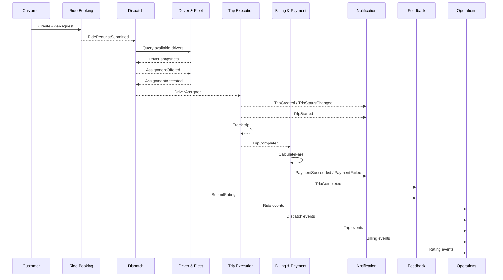

---

# 20. Domain Model chi tiết cấp hệ thống

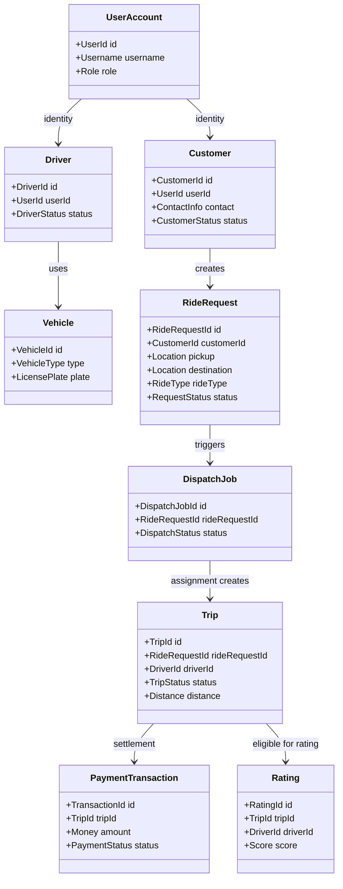

> Sơ đồ trên là **context-level domain relationship**, không có nghĩa tất cả class này được đặt chung một package hay một database.

---

# 21. Cấu trúc DDD đề xuất

Có thể bắt đầu dưới dạng **Modular Monolith** nhưng giữ Boundary đủ rõ để sau này tách Microservices.

```text
cab-system/
│
├── src/
│   ├── contexts/
│   │   │
│   │   ├── identity-access/
│   │   │   ├── domain/
│   │   │   │   ├── entities/
│   │   │   │   ├── value-objects/
│   │   │   │   ├── aggregates/
│   │   │   │   ├── repositories/
│   │   │   │   ├── services/
│   │   │   │   └── events/
│   │   │   ├── application/
│   │   │   │   ├── commands/
│   │   │   │   ├── handlers/
│   │   │   │   ├── queries/
│   │   │   │   └── dto/
│   │   │   ├── infrastructure/
│   │   │   │   ├── persistence/
│   │   │   │   └── security/
│   │   │   └── interfaces/
│   │   │       └── controllers/
│   │   │
│   │   ├── customer-management/
│   │   ├── driver-fleet/
│   │   ├── ride-booking/
│   │   ├── dispatch/
│   │   ├── trip-execution/
│   │   ├── billing-payment/
│   │   ├── notification/
│   │   ├── feedback-rating/
│   │   └── operations-analytics/
│   │
│   └── shared-kernel/
│       ├── primitives/
│       ├── event-bus/
│       └── contracts/
│
├── tests/
│   ├── unit/
│   ├── integration/
│   └── contract/
│
└── docs/
    ├── bounded-contexts.md
    ├── context-map.md
    └── adr/
```

### Quy tắc Shared Kernel

`shared-kernel` phải rất nhỏ. Chỉ để các primitive kỹ thuật thực sự trung lập, ví dụ:

- `Result<T>`.
- `DomainEvent` interface.
- `CorrelationId`.
- `Clock`.
- Base technical types.

**Không đặt `Trip`, `Driver`, `Customer`, `Payment` vào Shared Kernel.**

---

# 22. Domain / Application / Infrastructure / Interface

Mỗi context nên tuân cấu trúc 4 lớp:

```text
Interfaces
   ↓
Application
   ↓
Domain
   ↑
Infrastructure
```

## Domain

Chứa nghiệp vụ thuần:

- Aggregate.
- Entity.
- Value Object.
- Domain Service.
- Domain Event.
- Repository interface.

## Application

Điều phối use case:

- Command handler.
- Query handler.
- Transaction boundary.
- DTO.
- Publish event.

Application không chứa luật nghiệp vụ sâu của aggregate.

## Infrastructure

Chứa:

- Database.
- ORM.
- Message broker.
- Payment provider adapter.
- Notification provider adapter.

## Interfaces

Chứa:

- REST controller.
- WebSocket handler.
- Message consumer.
- Request/response mapping.

---

# 23. Mapping Use Case hiện tại vào Bounded Context

| Use Case trong SRS | Context đề xuất |
|---|---|
| UC01 Đặt xe | Ride Booking + Dispatch |
| UC02 Tìm tài xế | Dispatch |
| UC03 Theo dõi chuyến đi | Trip Execution & Tracking |
| UC04 Thanh toán | Billing & Payment |
| UC05 Đánh giá tài xế | Feedback & Rating |
| UC06 Quản lý tài khoản khách hàng | Identity & Access + Customer Management |
| UC07 Quản lý hồ sơ tài xế | Driver & Fleet + Identity & Access |
| UC08 Quản lý phương tiện | Driver & Fleet |
| UC09 Cập nhật trạng thái tài xế | Driver & Fleet |
| UC10 Nhận và xử lý yêu cầu chuyến | Dispatch + Driver & Fleet |
| UC11 Cập nhật trạng thái chuyến | Trip Execution & Tracking |
| UC12 Cập nhật vị trí tài xế | Driver & Fleet + Trip Execution read side |
| UC13 Quản lý thông báo | Notification |
| UC14 Quản lý khách hàng | Customer Management |
| UC15 Quản lý tài xế và chuyến đi | Operations & Analytics + Driver/Trip Context APIs |
| UC16 Tra cứu lịch sử giao dịch | Operations & Analytics đọc Payment Projection |
| UC17 Xem báo cáo vận hành | Operations & Analytics |

---

# 24. Mapping Business Rules vào Context

| Business Rule | Context chịu trách nhiệm |
|---|---|
| Người dùng phải đăng nhập trước khi đặt xe | Identity & Access + Ride Booking policy |
| Chỉ driver sẵn sàng mới nhận chuyến | Driver & Fleet + Dispatch |
| Ưu tiên driver phù hợp/gần | Dispatch |
| Driver từ chối → tìm driver khác | Dispatch |
| Không có driver → báo khách | Dispatch + Notification |
| Trip phải đi đúng trạng thái | Trip Execution |
| Trip hoàn thành → tính cước | Trip Execution + Billing |
| Hỗ trợ cash/electronic | Billing & Payment |
| Chỉ trip hoàn thành mới đánh giá | Feedback & Rating |
| Operator chỉ thao tác theo quyền | Identity & Access + Operations |
| Dữ liệu người dùng được bảo vệ | Identity & Access + từng context owner |

---

# 25. Những điều không nên thiết kế

## 25.1. Không tạo một `User` Entity dùng cho toàn hệ thống

`UserAccount` thuộc Identity & Access. `Customer` và `Driver` là domain model riêng.

Không làm:

```text
User {
  customerFields...
  driverFields...
  paymentFields...
  tripFields...
}
```

Đây là dấu hiệu của **God Entity**.

## 25.2. Không để Trip chứa Payment object

Không làm:

```text
Trip.payment.amount
```

Nên làm:

```text
TripCompleted
    -> Billing
    -> PaymentTransaction
```

## 25.3. Không để Reporting JOIN trực tiếp toàn bộ database

Thay bằng event-based projections.

## 25.4. Không dùng một trạng thái `TripStatus` cho Driver Status

Hai context có vocabulary khác nhau:

```text
Driver & Fleet:
READY / BUSY / OFFLINE

Trip Execution:
ASSIGNED / ARRIVED / IN_PROGRESS / COMPLETED / CANCELLED
```

Không gộp thành một enum dùng chung.

---

# 26. Anti-Corruption Layer

ACL cần có ở những chỗ mô hình ngoài không giống mô hình domain CAB.

## 26.1. Payment ACL

External provider có thể dùng:

```text
merchant_transaction_id
provider_status
provider_reference
```

Domain CAB nên chuyển thành:

```text
TransactionId
PaymentStatus
PaymentReference
```

## 26.2. Notification ACL

Provider có thể dùng `messageId`, `deliveryStatus`, `channel`. Domain chỉ cần `NotificationId`, `DeliveryStatus`, `Channel`.

## 26.3. Driver snapshot trong Dispatch

Dispatch không import Driver Aggregate từ Driver & Fleet.

Thay vào đó:

```text
Driver & Fleet
      |
      | DriverAvailabilitySnapshot
      v
Dispatch
```

Điều này giúp Dispatch giữ mô hình riêng.

---

# 27. Transaction Boundary

Một transaction database chỉ nên nằm trong **một Bounded Context**.

### Ví dụ đặt xe

```text
Transaction 1 – Ride Booking
    create RideRequest
    commit

Event: RideRequestSubmitted

Transaction 2 – Dispatch
    create DispatchJob
    choose candidate
    commit

Event: DriverAssigned

Transaction 3 – Trip Execution
    create Trip
    commit
```

Không nên mở một transaction SQL xuyên qua:

```text
Ride DB + Dispatch DB + Driver DB + Payment DB
```

---

# 28. Consistency Model

| Dữ liệu | Consistency |
|---|---|
| User credential | Strong consistency |
| RideRequest state | Strong trong Ride Booking |
| Dispatch assignment | Strong trong Dispatch |
| Trip state transition | Strong trong Trip Execution |
| Payment transaction state | Strong trong Billing |
| Notification delivery | Eventual |
| Operations report | Eventual |
| Driver position | Eventual / near real-time |

Đây là lý do Reporting, Notification và một phần Tracking không cần làm tất cả trong cùng database transaction.

---

# 29. Idempotency

Các operation nhận event từ message broker phải có khả năng xử lý lại an toàn.

Ví dụ:

```text
Event: TripCompleted
EventId: EVT-123
```

Billing lưu:

```text
ProcessedEvent(EventId = EVT-123)
```

Nếu nhận lại `EVT-123`, Billing không tạo thêm một PaymentTransaction.

Tương tự cho:

- Notification.
- Operations projection.
- Payment callback.

---

# 30. Trạng thái và Ownership

## Driver state

**Owner:** Driver & Fleet.

```text
OFFLINE → READY → BUSY → READY
   \________________________/
```

## Ride Request state

**Owner:** Ride Booking.

```text
REQUESTED → SEARCHING → ASSIGNED / CANCELLED
```

## Dispatch state

**Owner:** Dispatch.

```text
CREATED → SEARCHING → OFFERED → ACCEPTED
                          |
                          +→ REJECTED → NEXT CANDIDATE
                          |
                          +→ EXPIRED → NEXT CANDIDATE
```

## Trip state

**Owner:** Trip Execution.

```text
ASSIGNED → ARRIVING → ARRIVED → IN_PROGRESS → COMPLETED
```

## Payment state

**Owner:** Billing & Payment.

```text
PENDING → PROCESSING → SUCCEEDED
                    \→ FAILED → RETRY
```

---

# 31. Định hướng triển khai: Modular Monolith → Microservices

Không cần tách 10 context thành 10 service ngay từ đầu.

## Giai đoạn 1 – Modular Monolith

Một ứng dụng duy nhất nhưng:

```text
contexts/
  identity-access/
  customer-management/
  driver-fleet/
  ride-booking/
  dispatch/
  trip-execution/
  billing-payment/
  notification/
  feedback-rating/
  operations-analytics/
```

Mỗi module có database schema/table ownership riêng.

## Giai đoạn 2 – Tách Core Context

Ưu tiên tách:

```text
Ride Booking
Dispatch
Trip Execution
Driver & Fleet
Billing & Payment
```

## Giai đoạn 3 – Tách Supporting Context

Sau đó mới cân nhắc:

```text
Notification
Feedback
Operations
Identity
```

Việc tách service nên dựa vào tải, team ownership, deployment independence và yêu cầu mở rộng, không phải cứ có Bounded Context là bắt buộc có một microservice.

---

# 32. Phân loại Core / Supporting / Generic

| Context | Phân loại | Lý do |
|---|---|---|
| Ride Booking | Core | Trực tiếp tạo giá trị từ nhu cầu đi xe |
| Dispatch | Core | Quyết định matching và phân công |
| Trip Execution | Core | Hoàn thành dịch vụ vận tải |
| Driver & Fleet | Core/Supporting | Nguồn lực cốt lõi để thực hiện chuyến |
| Billing & Payment | Core/Supporting | Tạo doanh thu và giao dịch |
| Customer Management | Supporting | Quản lý profile |
| Feedback & Rating | Supporting | Hậu mãi/trải nghiệm |
| Notification | Supporting/Generic | Hạ tầng giao tiếp |
| Identity & Access | Generic/Supporting | Xác thực/phân quyền |
| Operations & Analytics | Supporting | Hỗ trợ vận hành/quyết định |

---

# 33. Các Domain Service nên có

## Dispatch

`DriverMatchingService`

`AssignmentPolicy`

## Trip Execution

`TripStateTransitionPolicy`

## Billing

`FareCalculationService`

`PaymentRetryPolicy`

## Feedback

`RatingEligibilityService`

## Notification

`NotificationRoutingPolicy`

Các service này chỉ chứa logic thật sự không phù hợp với một Entity/Value Object đơn lẻ.

---

# 34. Repository Interface theo DDD

Ví dụ tại Dispatch:

```text
interface DispatchJobRepository {
    findById(dispatchJobId)
    save(dispatchJob)
}
```

Tại Trip Execution:

```text
interface TripRepository {
    findById(tripId)
    save(trip)
}
```

Tại Billing:

```text
interface PaymentTransactionRepository {
    findById(transactionId)
    save(transaction)
}
```

Không tạo một `GenericRepository` để cho mọi context thao tác mọi entity.

---

# 35. API/Contract giữa các Context

## Ride Booking → Dispatch

```json
{
  "eventType": "RideRequestSubmitted",
  "eventId": "evt-001",
  "rideRequestId": "ride-123",
  "customerId": "cus-9",
  "pickup": {
    "latitude": 10.776,
    "longitude": 106.700
  },
  "destination": {
    "latitude": 10.801,
    "longitude": 106.652
  },
  "rideType": "CAR"
}
```

## Trip Execution → Billing

```json
{
  "eventType": "TripCompleted",
  "eventId": "evt-010",
  "tripId": "trip-500",
  "completedAt": "2026-09-23T12:30:00Z",
  "distance": 8.4
}
```

## Trip Execution → Notification

```json
{
  "eventType": "TripStatusChanged",
  "eventId": "evt-011",
  "tripId": "trip-500",
  "status": "COMPLETED",
  "customerId": "cus-9"
}
```

Các contract trên là **integration contract**, không phải Domain Entity của context nhận.

---

# 36. Mapping với các Business Goal

| Business Goal | Bounded Context đóng góp chính |
|---|---|
| BG01 Tự động hóa đặt xe | Ride Booking + Dispatch |
| BG02 Trải nghiệm khách hàng | Customer + Ride Booking + Trip Tracking + Notification + Billing |
| BG03 Hiệu quả vận hành | Operations + Driver & Fleet + Trip Execution |
| BG04 Mở rộng quy mô | Context isolation + event-driven integration |
| BG05 Quản lý doanh thu | Billing & Payment + Operations |
| BG06 Bảo mật | Identity & Access + context data ownership |
| BG07 Ra quyết định | Operations & Analytics |
| BG08 Phát triển lâu dài | Bounded Context + ACL + Integration Events |

---

# 37. Traceability với Functional Requirement

| Functional Requirement | Context |
|---|---|
| FR01 Quản lý tài khoản | Identity & Access |
| FR02 Xác định vị trí khách hàng | Ride Booking |
| FR03 Xác định điểm đón | Ride Booking |
| FR04 Xác định điểm đến | Ride Booking |
| FR05 Tìm tài xế sẵn có | Dispatch + Driver & Fleet |
| FR06 Lọc theo loại xe | Dispatch |
| FR07 Tính khoảng cách | Dispatch |
| FR08 Phân công tài xế | Dispatch |
| FR09 Xử lý từ chối | Dispatch |
| FR10 Theo dõi chuyến | Trip Execution & Tracking |
| FR11 Cập nhật trạng thái chuyến | Trip Execution & Tracking |
| FR12 Tính cước | Billing & Payment |
| FR13 Thanh toán | Billing & Payment |
| FR14 Thông báo | Notification |
| FR15 Đánh giá tài xế | Feedback & Rating |
| FR16 Quản lý vận hành | Operations + context owner APIs |
| FR17 Báo cáo | Operations & Analytics |
| FR18 Phân quyền | Identity & Access |
| FR19 Bảo mật | Identity & Access + Infrastructure/Security |

---

# 38. Vấn đề cần chỉnh trong SRS trước khi triển khai DDD

## 38.1. Mâu thuẫn ở phần truy xuất nguồn gốc yêu cầu

Phần cuối `srs.md` xuất hiện các requirement như:

- “Tạo và quản lý yêu cầu bảo dưỡng/sửa chữa”.
- “Phân công kỹ thuật viên”.
- “Quản lý phụ tùng/vật tư”.
- “Lập báo giá dịch vụ”.
- “Tra cứu lịch sử dịch vụ”.

Đây là vocabulary của **hệ thống bảo dưỡng/sửa chữa**, không phải luồng CAB đặt xe. Vì vậy không nên đưa chúng vào các Bounded Context của CAB nếu đề tài vẫn là Cab System.

### Đề xuất xử lý

1. Nếu đề tài đúng là **Cab System**, thay toàn bộ phần traceability cuối SRS bằng traceability của CAB.
2. Nếu thực sự muốn xây cả **Garage/Maintenance System**, đây phải là một domain/context hoặc một bounded context khác với aggregate và ubiquitous language riêng.
3. Không trộn `Technician`, `RepairOrder`, `SparePart`, `ServiceQuote` vào `Trip`, `Dispatch`, `Payment` của CAB.

---

# 39. Bộ Ubiquitous Language đề xuất cho CAB

Để tránh nhầm khi code, dùng bảng sau như từ điển chuẩn:

| Context | Nên dùng | Không nên dùng thay thế |
|---|---|---|
| Identity | UserAccount, Credential, Role, Permission | CustomerAccount cho authentication |
| Customer | Customer, CustomerProfile | User thay cho Customer |
| Driver & Fleet | Driver, Vehicle, Availability, Position | User thay cho Driver |
| Ride Booking | RideRequest, Pickup, Destination | Trip cho yêu cầu chưa được thực hiện |
| Dispatch | Candidate, AssignmentOffer, DispatchJob | BookingDriver |
| Trip Execution | Trip, TripStatus, TrackingPoint | RideRequest cho chuyến đang chạy |
| Billing | Fare, PaymentTransaction, Money | TripAmount |
| Notification | Recipient, Channel, DeliveryAttempt | Message nếu cần semantic rõ hơn |
| Feedback | Rating, Score, ReviewEligibility | FeedbackStatus dùng chung mọi context |
| Operations | Projection, Metric, Incident, Report | Source Entity |

---

# 40. Checklist triển khai DDD

## Boundary

- [ ] Mỗi context có database/schema ownership.
- [ ] Không import aggregate từ context khác.
- [ ] Chỉ chia sẻ ID hoặc integration contract.
- [ ] External provider được bọc bởi Adapter/ACL.

## Domain

- [ ] Aggregate bảo vệ invariant.
- [ ] Value Object dùng cho concept có identity/value semantics rõ.
- [ ] Domain Event biểu diễn state change có ý nghĩa.
- [ ] Domain Service chỉ dùng khi logic không thuộc một entity.

## Application

- [ ] Mỗi use case có command/query rõ ràng.
- [ ] Application layer điều phối, không chứa domain logic sâu.
- [ ] Cross-context workflow dùng integration event hoặc API contract.

## Data

- [ ] Không JOIN trực tiếp DB khác context.
- [ ] Không dùng shared entity package.
- [ ] Reporting dùng projection.
- [ ] Consumer xử lý event có idempotency.

## Kiểm thử

- [ ] Unit test aggregate.
- [ ] Unit test domain policy.
- [ ] Integration test repository.
- [ ] Contract test giữa các context.
- [ ] Test idempotency cho event consumer.

---

# 41. Kiến trúc mục tiêu – phiên bản ngắn gọn

```text
                         +----------------------+
                         | Identity & Access    |
                         +----------+-----------+
                                    |
                 +------------------+------------------+
                 |                                     |
                 v                                     v
       +----------------------+             +----------------------+
       | Customer Management  |             | Driver & Fleet       |
       +----------+-----------+             +----------+-----------+
                  |                                    |
                  v                                    v
       +----------------------+          +-----------------------+
       | Ride Booking        |---------> | Dispatch              |
       +----------------------+           +----------+------------+
                                                   |
                                                   v
                                      +---------------------------+
                                      | Trip Execution & Tracking |
                                      +----+---------------+------+
                                           |               |
                              TripCompleted|               |TripStatusChanged
                                           v               v
                                  +----------------+   +----------------+
                                  | Billing &      |   | Notification   |
                                  | Payment        |   +----------------+
                                  +-------+--------+
                                          |
                                          v
                               External Payment Provider

                         +--------------------------+
                         | Feedback & Rating        |
                         +------------^-------------+
                                      |
                                TripCompleted

        All domain events -----------------------------> Operations & Analytics
```

---

# 42. Kết luận thiết kế

CAB System nên được nhìn như một **Domain Model gồm nhiều ranh giới nghiệp vụ**, không phải một model duy nhất chứa tất cả bảng `Customer`, `Driver`, `Trip`, `Payment`, `Rating`, `Notification`.

Boundary quan trọng nhất là:

```text
Ride Booking
      ↓
Dispatch
      ↓
Trip Execution
      ↓
Billing
```

Trong khi đó:

```text
Driver & Fleet  → cung cấp nguồn lực cho Dispatch
Notification    → phản ứng với domain events
Feedback        → phản ứng sau TripCompleted
Operations      → đọc dữ liệu từ event/projection
Identity        → cung cấp identity và authorization
Customer        → cung cấp customer profile
```

Mỗi context giữ **Ubiquitous Language riêng**, sở hữu model riêng và chỉ trao đổi với nhau qua boundary rõ ràng. Đây là cơ sở để hệ thống có thể bắt đầu bằng Modular Monolith nhưng vẫn giữ khả năng tách Microservices khi cần.

---

# 43. Nguồn tham chiếu

- Repository: https://github.com/ggiathinh65-debug/23671881_VuGiaThinh_Cabsystem
- SRS hiện tại: https://raw.githubusercontent.com/ggiathinh65-debug/23671881_VuGiaThinh_Cabsystem/main/srs.md


---

# 44. BỔ SUNG – MAPPING BOUNDED CONTEXT ↔ CHỨC NĂNG ↔ FR ↔ BUSINESS PROCESS MODEL

Phần này bổ sung chi tiết triển khai cho 10 Bounded Context đã xác định ở trên. Quy tắc đọc bảng:

- **Làm gì?** = trách nhiệm nghiệp vụ mà Boundary đó được phép sở hữu.
- **FR liên quan** = Functional Requirement trong `srs.md` mà context trực tiếp thực hiện hoặc đóng góp.
- **Workflow** = Business Process Model mà context tham gia.
- **Microservice** = một service triển khai độc lập, có database riêng.
- **UL** = Ubiquitous Language của riêng context, không dùng entity/model của context khác.

## 44.1. Ma trận tổng hợp

| BC | Bounded Context | Làm gì? | FR liên quan | Workflow (BPM) | Microservice | Database |
|---|---|---|---|---|---|---|
| BC01 | Identity & Access | Đăng ký, đăng nhập, xác thực, phân quyền tài khoản | FR01, FR18, FR19 | W01, W08 | `identity-service` | `identity_db` |
| BC02 | Customer Management | Quản lý hồ sơ khách hàng, trạng thái nghiệp vụ | FR01 (phần hồ sơ), FR16 | W01, W02, W07, W08 | `customer-service` | `customer_db` |
| BC03 | Driver & Fleet | Quản lý tài xế, phương tiện, availability, vị trí | FR05, FR06, FR10, FR16 | W03, W04, W08 | `driver-fleet-service` | `driver_fleet_db` |
| BC04 | Ride Booking | Tạo yêu cầu chuyến, pickup, destination, loại xe | FR02, FR03, FR04 | W02 | `ride-booking-service` | `ride_booking_db` |
| BC05 | Dispatch | Tìm, xếp hạng, mời và phân công tài xế | FR05, FR06, FR07, FR08, FR09 | W03 | `dispatch-service` | `dispatch_db` |
| BC06 | Trip Execution & Tracking | Quản lý vòng đời chuyến và theo dõi hành trình | FR10, FR11 | W04 | `trip-service` | `trip_db` |
| BC07 | Billing & Payment | Tính cước và xử lý thanh toán | FR12, FR13 | W05 | `billing-payment-service` | `billing_db` |
| BC08 | Notification | Gửi thông báo theo event và policy | FR14 | W02, W03, W04, W05, W06, W07 | `notification-service` | `notification_db` |
| BC09 | Feedback & Rating | Kiểm tra quyền đánh giá và lưu đánh giá tài xế | FR15 | W07 | `feedback-service` | `feedback_db` |
| BC10 | Operations & Analytics | Tra cứu vận hành, lịch sử, chỉ số và báo cáo | FR16, FR17 | W08 | `operations-analytics-service` | `operations_db` |

> **FR18–FR19 là cross-cutting requirements:** Identity & Access là nơi thực thi trực tiếp; các microservice còn lại phải áp dụng authorization, audit, validation và data protection tương ứng.

---

# 45. BUSINESS PROCESS MODEL – CÁC WORKFLOW CHÍNH

## 45.1. W01 – Đăng ký / Đăng nhập / Xác thực quyền

**Mục tiêu:** xác minh danh tính trước khi người dùng thực hiện chức năng được bảo vệ.

**FR:** FR01, FR18, FR19.

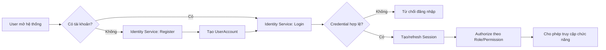

**BC tham gia:** BC01 là owner; BC02 tạo/cập nhật `CustomerProfile` sau khi có identity nếu người dùng là khách hàng; BC10 áp dụng permission để bảo vệ API vận hành.

---

## 45.2. W02 – Đặt xe

**Mục tiêu:** tiếp nhận một nhu cầu đi xe hoàn chỉnh và đưa yêu cầu sang Dispatch.

**FR:** FR02, FR03, FR04.

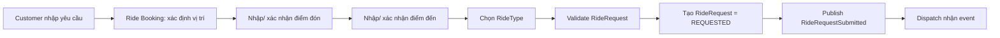

**Kết quả:** `RideRequest` được tạo thành công và không chứa `Driver` object.

---

## 45.3. W03 – Tìm và phân công tài xế

**Mục tiêu:** tự động tìm candidate phù hợp và hoàn thành assignment.

**FR:** FR05, FR06, FR07, FR08, FR09.

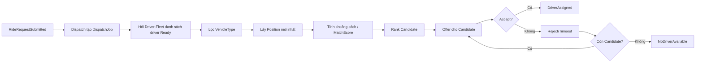

**Kết quả:** hoặc `DriverAssigned`, hoặc kết thúc bằng `NoDriverAvailable` và Notification báo khách.

---

## 45.4. W04 – Thực hiện và theo dõi chuyến

**Mục tiêu:** quản lý state machine của `Trip` và ghi nhận vị trí.

**FR:** FR10, FR11.

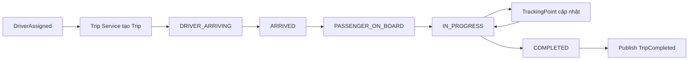

**Kết quả:** `TripCompleted` là integration event cho Billing, Feedback và Operations.

---

## 45.5. W05 – Tính cước và thanh toán

**Mục tiêu:** sau khi chuyến hoàn tất, xác định số tiền phải thu và ghi nhận thanh toán.

**FR:** FR12, FR13.

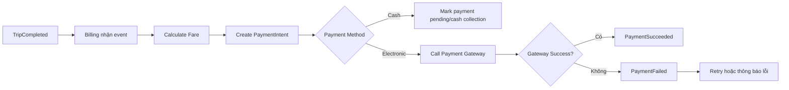

---

## 45.6. W06 – Gửi thông báo

**Mục tiêu:** biến business event thành thông báo đến đúng người, đúng kênh.

**FR:** FR14.

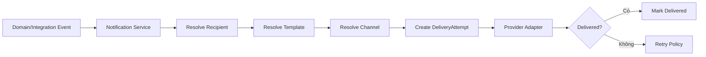

---

## 45.7. W07 – Đánh giá tài xế

**Mục tiêu:** chỉ cho phép customer đánh giá khi trip đạt điều kiện nghiệp vụ.

**FR:** FR15.

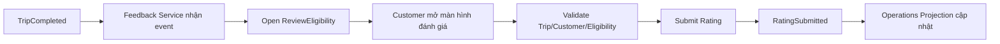

---

## 45.8. W08 – Vận hành và báo cáo

**Mục tiêu:** nhân viên vận hành tra cứu và quản lý hệ thống bằng read model độc lập.

**FR:** FR16, FR17; áp dụng FR18, FR19 cho authorization và bảo mật.

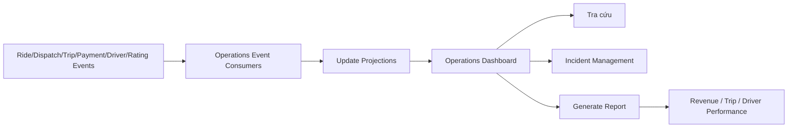

---

# 46. CHI TIẾT BOUNDED CONTEXT VÀ MICROSERVICE

## 46.1. BC01 – Identity & Access → `identity-service`

### Làm gì?

- Đăng ký tài khoản.
- Đăng nhập và refresh session.
- Quản lý role/permission.
- Chặn/kích hoạt tài khoản.
- Cấp identity cho các service khác thông qua token/claims.

### FR liên quan

`FR01, FR18, FR19`.

### Workflow phục vụ

`W01 – Đăng ký/Đăng nhập`; hỗ trợ authorization trong `W02–W08`.

### Bảng ngôn ngữ thống nhất của BC

| Thuật ngữ | Định nghĩa | Động từ chuẩn | Không dùng thay cho |
|---|---|---|---|
| UserAccount | Danh tính đăng nhập | register, disable | Customer, Driver |
| Credential | Dữ liệu xác thực | authenticate, change | Password của domain khác |
| Role | Nhóm quyền | assignRole | DriverRole trong Driver domain |
| Permission | Quyền thao tác | authorize | Business permission của domain khác |
| Session | Phiên xác thực | create, refresh, revoke | Trip session |

### API chính

| Method | Endpoint | Mục đích |
|---|---|---|
| POST | `/api/v1/auth/register` | Tạo UserAccount |
| POST | `/api/v1/auth/login` | Xác thực và cấp token |
| POST | `/api/v1/auth/refresh` | Refresh session |
| POST | `/api/v1/auth/logout` | Revoke session |
| GET | `/api/v1/users/{userId}` | Lấy thông tin identity |
| GET | `/api/v1/users/{userId}/permissions` | Lấy quyền |
| PUT | `/api/v1/users/{userId}/roles` | Gán role |
| PATCH | `/api/v1/users/{userId}/status` | Enable/disable account |

### Database: `identity_db`

**Database owner:** chỉ `identity-service`.

| Table | Cột chính | Ý nghĩa |
|---|---|---|
| `user_accounts` | `id`, `username`, `email`, `password_hash`, `status`, `created_at` | UserAccount |
| `roles` | `id`, `code`, `name` | Role |
| `permissions` | `id`, `code`, `name` | Permission |
| `user_roles` | `user_id`, `role_id` | Mapping account-role |
| `role_permissions` | `role_id`, `permission_id` | Mapping role-permission |
| `sessions` | `id`, `user_id`, `refresh_token_hash`, `expires_at`, `revoked_at` | Session |

### ERD

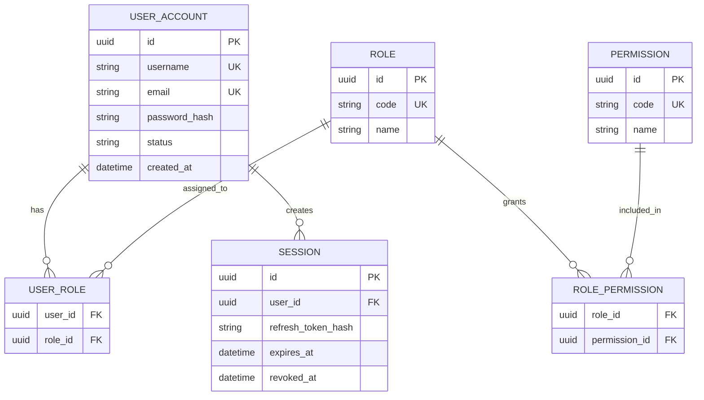

### Event publish

`UserRegistered`, `UserDisabled`, `RoleAssigned`.

---

## 46.2. BC02 – Customer Management → `customer-service`

### Làm gì?

- Tạo và quản lý hồ sơ customer.
- Quản lý contact information.
- Theo dõi customer status ở góc nhìn nghiệp vụ.
- Xác định customer có đủ điều kiện sử dụng dịch vụ ở tầng business policy.

### FR liên quan

`FR01` (phần thông tin account/profile), `FR16` (quản lý vận hành khách hàng).

### Workflow phục vụ

`W01`, `W02`, `W07`, `W08`.

### Bảng ngôn ngữ thống nhất

| Thuật ngữ | Định nghĩa | Động từ chuẩn | Không dùng thay cho |
|---|---|---|---|
| Customer | Người mua/sử dụng dịch vụ | create, update, suspend | UserAccount |
| CustomerProfile | Hồ sơ nghiệp vụ của customer | updateProfile | Credential |
| ContactInfo | Thông tin liên hệ | changeContact | Identity credential |
| CustomerStatus | Trạng thái sử dụng dịch vụ | suspend, restore | TripStatus, DriverStatus |

### API chính

| Method | Endpoint | Mục đích |
|---|---|---|
| POST | `/api/v1/customers` | Tạo customer profile |
| GET | `/api/v1/customers/{customerId}` | Xem hồ sơ |
| PATCH | `/api/v1/customers/{customerId}` | Cập nhật hồ sơ |
| PATCH | `/api/v1/customers/{customerId}/status` | Suspend/restore |
| GET | `/api/v1/customers/{customerId}/service-eligibility` | Kiểm tra khả năng sử dụng dịch vụ |
| GET | `/api/v1/customers?query=...` | Tra cứu vận hành |

### Database: `customer_db`

| Table | Cột chính | Ý nghĩa |
|---|---|---|
| `customers` | `id`, `user_id`, `full_name`, `status`, `created_at` | Customer aggregate |
| `customer_contacts` | `id`, `customer_id`, `phone`, `email`, `is_primary` | ContactInfo |
| `customer_status_history` | `id`, `customer_id`, `old_status`, `new_status`, `changed_at` | Audit nghiệp vụ |

**Quy tắc:** `user_id` chỉ là external identity reference; không có FK xuyên database sang `identity_db`.

### ERD

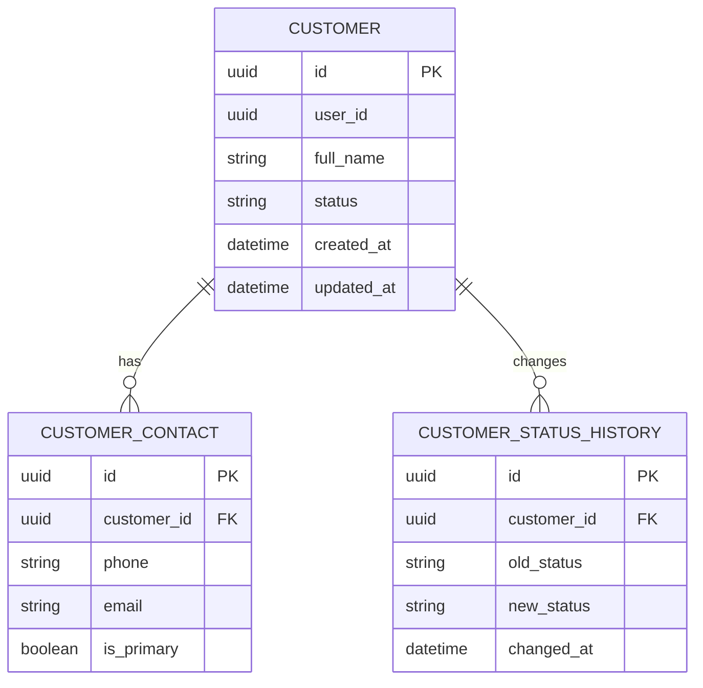

### Event publish

`CustomerCreated`, `CustomerProfileUpdated`, `CustomerSuspended`, `CustomerRestored`.

---

## 46.3. BC03 – Driver & Fleet → `driver-fleet-service`

### Làm gì?

- Quản lý hồ sơ nghiệp vụ tài xế.
- Quản lý phương tiện.
- Quản lý availability (`ONLINE`, `READY`, `BUSY`, `OFFLINE`).
- Ghi nhận vị trí gần nhất của tài xế.
- Cung cấp read API để Dispatch tìm driver đủ điều kiện.

### FR liên quan

`FR05, FR06, FR10, FR16`; hỗ trợ trực tiếp các UC quản lý tài xế, phương tiện và trạng thái tài xế.

### Workflow phục vụ

`W03 – Dispatch`, `W04 – Trip Execution`, `W08 – Operations`.

### Bảng ngôn ngữ thống nhất

| Thuật ngữ | Định nghĩa | Động từ chuẩn | Không dùng thay cho |
|---|---|---|---|
| Driver | Nguồn lực tài xế | register, update | UserAccount |
| Vehicle | Phương tiện phục vụ | registerVehicle | Trip |
| Availability | Khả năng nhận chuyến | becomeReady, becomeBusy | TripStatus |
| DriverPosition | Vị trí gần nhất | updatePosition | Pickup/Destination |
| Ready | Có thể nhận assignment | markReady | Available payment |

### API chính

| Method | Endpoint | Mục đích |
|---|---|---|
| POST | `/api/v1/drivers` | Tạo hồ sơ driver |
| GET | `/api/v1/drivers/{driverId}` | Xem driver |
| PATCH | `/api/v1/drivers/{driverId}` | Cập nhật hồ sơ |
| POST | `/api/v1/drivers/{driverId}/vehicles` | Đăng ký vehicle |
| GET | `/api/v1/vehicles/{vehicleId}` | Xem vehicle |
| PATCH | `/api/v1/drivers/{driverId}/availability` | Đổi availability |
| POST | `/api/v1/drivers/{driverId}/positions` | Cập nhật vị trí |
| GET | `/api/v1/drivers/available?lat=...&lng=...&vehicleType=...` | Tìm driver sẵn sàng |
| POST | `/api/v1/drivers/{driverId}/reserve` | Reserve driver cho dispatch |
| POST | `/api/v1/drivers/{driverId}/release` | Release driver |

### Database: `driver_fleet_db`

| Table | Cột chính | Ý nghĩa |
|---|---|---|
| `drivers` | `id`, `user_id`, `license_no`, `status` | Driver aggregate |
| `vehicles` | `id`, `plate_no`, `vehicle_type`, `status` | Vehicle |
| `driver_vehicles` | `driver_id`, `vehicle_id`, `from_at`, `to_at` | Quan hệ sử dụng |
| `driver_availability` | `driver_id`, `status`, `updated_at` | Availability hiện tại |
| `driver_positions` | `id`, `driver_id`, `lat`, `lng`, `recorded_at` | Position history |

### ERD

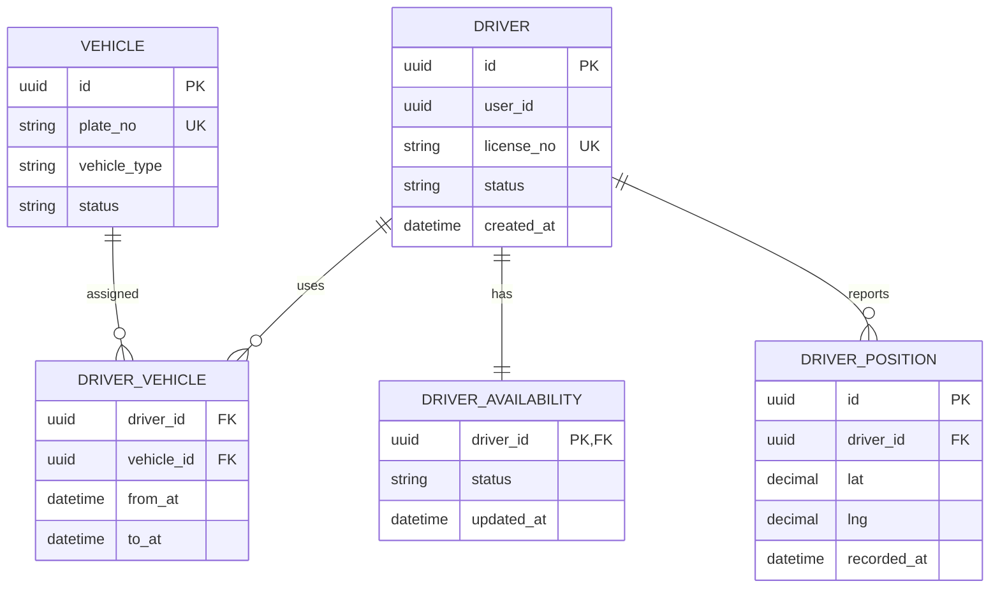

### Event publish

`DriverRegistered`, `VehicleRegistered`, `DriverBecameReady`, `DriverBecameBusy`, `DriverWentOffline`, `DriverPositionUpdated`.

---

## 46.4. BC04 – Ride Booking → `ride-booking-service`

### Làm gì?

- Nhận yêu cầu đặt xe.
- Xác định pickup, destination và loại xe.
- Validate dữ liệu booking.
- Cho phép customer hủy/sửa theo trạng thái cho phép.
- Phát `RideRequestSubmitted` cho Dispatch.

### FR liên quan

`FR02, FR03, FR04`.

### Workflow phục vụ

`W02 – Đặt xe`.

### Bảng ngôn ngữ thống nhất

| Thuật ngữ | Định nghĩa | Động từ chuẩn | Không dùng thay cho |
|---|---|---|---|
| RideRequest | Nhu cầu đi xe chưa phải chuyến thực thi | request, cancel | Trip |
| Pickup | Điểm khách muốn được đón | setPickup | DriverPosition |
| Destination | Điểm khách muốn đến | setDestination | Trip end position |
| RideType | Loại dịch vụ/xe yêu cầu | selectRideType | Vehicle entity |
| RequestStatus | Trạng thái booking | submit, cancel | TripStatus |

### API chính

| Method | Endpoint | Mục đích |
|---|---|---|
| POST | `/api/v1/ride-requests` | Tạo booking |
| GET | `/api/v1/ride-requests/{rideRequestId}` | Xem booking |
| PATCH | `/api/v1/ride-requests/{rideRequestId}/destination` | Cập nhật destination |
| POST | `/api/v1/ride-requests/{rideRequestId}/cancel` | Hủy booking |
| GET | `/api/v1/customers/{customerId}/ride-requests` | Lịch sử request của customer |

### Database: `ride_booking_db`

| Table | Cột chính | Ý nghĩa |
|---|---|---|
| `ride_requests` | `id`, `customer_id`, `ride_type`, `status`, `requested_at` | RideRequest aggregate |
| `ride_request_locations` | `id`, `ride_request_id`, `location_type`, `lat`, `lng`, `address` | Pickup/Destination |
| `ride_request_status_history` | `id`, `ride_request_id`, `from_status`, `to_status`, `changed_at` | History |

### ERD

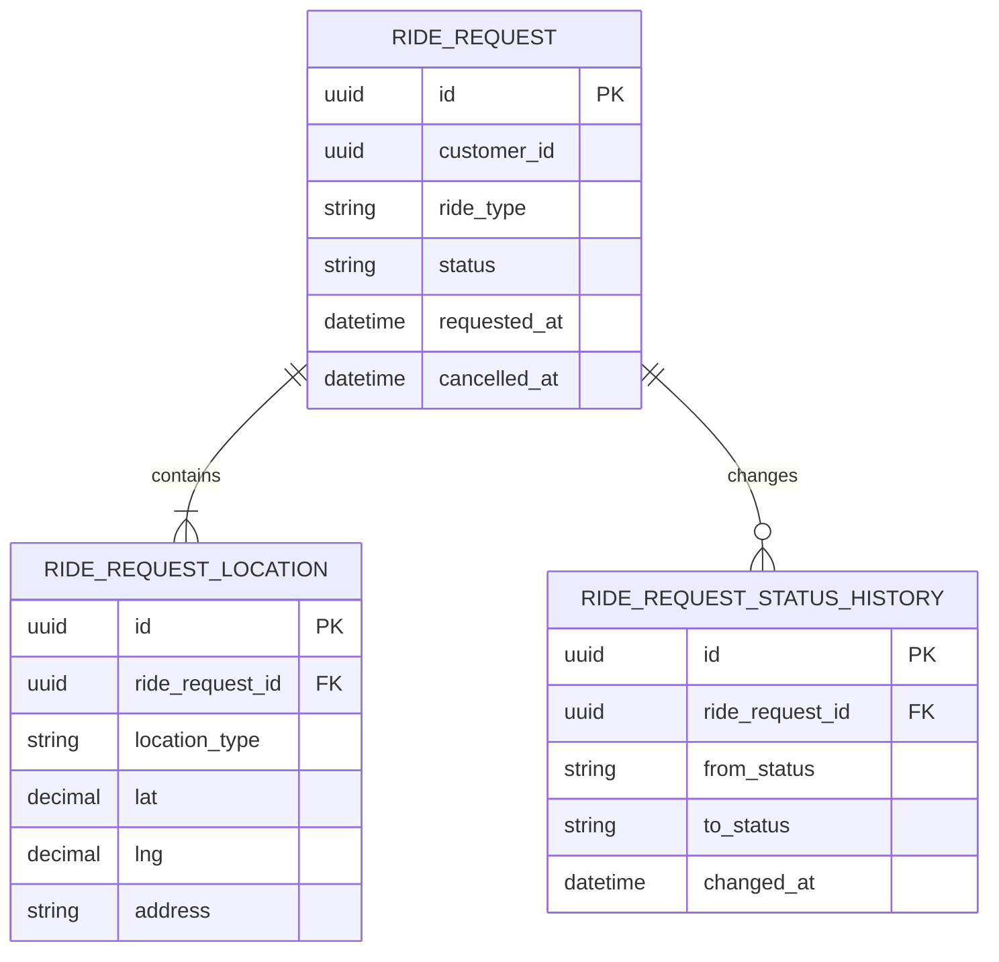

### Event publish

`RideRequestSubmitted`, `RideRequestUpdated`, `RideRequestCancelled`.

---

## 46.5. BC05 – Dispatch → `dispatch-service`

### Làm gì?

- Nhận booking đã submit.
- Lấy snapshot availability/position từ Driver-Fleet.
- Tính match score/khoảng cách.
- Gửi assignment offer.
- Xử lý accept, reject, timeout và retry.
- Kết luận `DriverAssigned` hoặc `NoDriverAvailable`.

### FR liên quan

`FR05, FR06, FR07, FR08, FR09`.

### Workflow phục vụ

`W03 – Tìm và phân công tài xế`.

### Bảng ngôn ngữ thống nhất

| Thuật ngữ | Định nghĩa | Động từ chuẩn | Không dùng thay cho |
|---|---|---|---|
| DispatchJob | Công việc tìm driver cho một request | start, retry | RideRequest |
| Candidate | Driver đủ điều kiện đang xét | rank, select | Driver aggregate |
| MatchScore | Điểm phù hợp của candidate | calculate | Rating score |
| AssignmentOffer | Lời mời nhận chuyến | offer, accept, reject | Payment intent |
| NoDriverAvailable | Không tìm được candidate | fail dispatch | TripCancelled |

### API chính

> Các API `/internal/*` dành cho service-to-service, không public cho frontend.

| Method | Endpoint | Mục đích |
|---|---|---|
| POST | `/internal/v1/dispatch-jobs` | Tạo DispatchJob từ RideRequest |
| GET | `/internal/v1/dispatch-jobs/{dispatchJobId}` | Xem trạng thái dispatch |
| GET | `/internal/v1/dispatch-jobs/by-ride/{rideRequestId}` | Tra cứu dispatch theo request |
| POST | `/internal/v1/assignment-offers/{offerId}/accept` | Accept offer |
| POST | `/internal/v1/assignment-offers/{offerId}/reject` | Reject offer |
| POST | `/internal/v1/assignment-offers/{offerId}/expire` | Expire offer bởi scheduler |
| POST | `/internal/v1/dispatch-jobs/{dispatchJobId}/retry` | Tìm candidate tiếp theo |

### Database: `dispatch_db`

| Table | Cột chính | Ý nghĩa |
|---|---|---|
| `dispatch_jobs` | `id`, `ride_request_id`, `status`, `started_at`, `completed_at` | DispatchJob |
| `dispatch_candidates` | `id`, `dispatch_job_id`, `driver_id`, `distance_km`, `match_score`, `rank_no`, `snapshot_at` | Candidate snapshot |
| `assignment_offers` | `id`, `dispatch_job_id`, `driver_id`, `status`, `offered_at`, `expires_at`, `responded_at` | Offer |
| `dispatch_idempotency` | `key`, `dispatch_job_id`, `created_at` | Chống xử lý trùng event |

### ERD

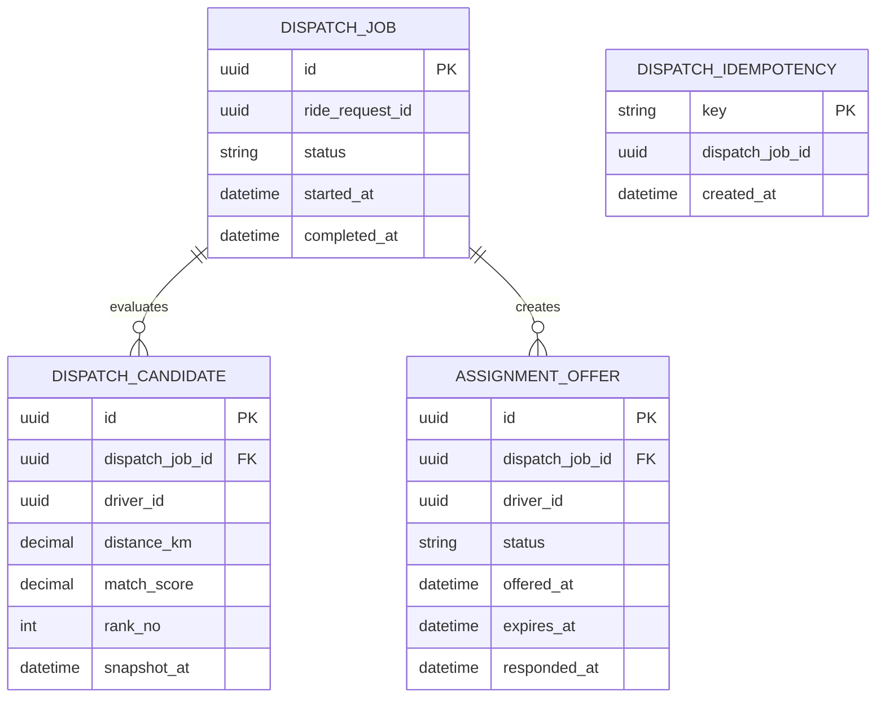

### Event publish

`DispatchStarted`, `AssignmentOffered`, `AssignmentAccepted`, `AssignmentRejected`, `AssignmentExpired`, `DriverAssigned`, `NoDriverAvailable`.

---

## 46.6. BC06 – Trip Execution & Tracking → `trip-service`

### Làm gì?

- Tạo Trip từ `DriverAssigned`.
- Điều khiển state machine của Trip.
- Ghi nhận trạng thái và tracking point.
- Phát `TripCompleted` cho Billing/Feedback/Operations.

### FR liên quan

`FR10, FR11`.

### Workflow phục vụ

`W04 – Thực hiện và theo dõi chuyến`.

### Bảng ngôn ngữ thống nhất

| Thuật ngữ | Định nghĩa | Động từ chuẩn | Không dùng thay cho |
|---|---|---|---|
| Trip | Chuyến đã được phân công và thực thi | start, complete, cancel | RideRequest |
| TripStatus | Trạng thái vòng đời Trip | transition | DriverStatus |
| TrackingPoint | Bản ghi vị trí theo thời gian | append | DriverPosition hiện tại |
| Completed | Trạng thái kết thúc thành công | complete | PaymentSucceeded |

### API chính

| Method | Endpoint | Mục đích |
|---|---|---|
| POST | `/internal/v1/trips` | Tạo Trip từ DriverAssigned |
| GET | `/api/v1/trips/{tripId}` | Xem chi tiết chuyến |
| POST | `/api/v1/trips/{tripId}/arrive` | Driver đã đến điểm đón |
| POST | `/api/v1/trips/{tripId}/start` | Bắt đầu chuyến |
| POST | `/api/v1/trips/{tripId}/positions` | Ghi tracking point |
| POST | `/api/v1/trips/{tripId}/complete` | Hoàn thành chuyến |
| POST | `/api/v1/trips/{tripId}/cancel` | Hủy chuyến theo policy |
| GET | `/api/v1/trips/{tripId}/tracking` | Lấy dữ liệu tracking |

### Database: `trip_db`

| Table | Cột chính | Ý nghĩa |
|---|---|---|
| `trips` | `id`, `ride_request_id`, `customer_id`, `driver_id`, `pickup_*`, `destination_*`, `status`, `started_at`, `completed_at`, `distance_km` | Trip aggregate |
| `trip_status_history` | `id`, `trip_id`, `from_status`, `to_status`, `changed_at`, `changed_by` | State transition |
| `tracking_points` | `id`, `trip_id`, `lat`, `lng`, `recorded_at` | Tracking |

### ERD

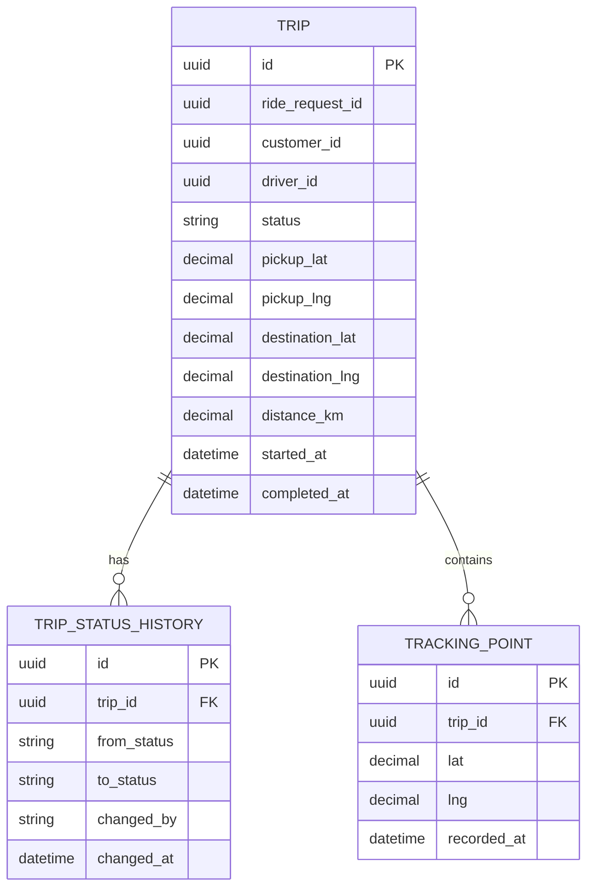

### Event publish

`TripCreated`, `TripStatusChanged`, `TripPositionUpdated`, `TripCompleted`, `TripCancelled`.

---

## 46.7. BC07 – Billing & Payment → `billing-payment-service`

### Làm gì?

- Nhận `TripCompleted`.
- Tính cước theo fare rule.
- Tạo payment intent/transaction.
- Gọi payment provider.
- Đảm bảo idempotency cho callback và retry.

### FR liên quan

`FR12, FR13`.

### Workflow phục vụ

`W05 – Tính cước và thanh toán`.

### Bảng ngôn ngữ thống nhất

| Thuật ngữ | Định nghĩa | Động từ chuẩn | Không dùng thay cho |
|---|---|---|---|
| Fare | Khoản tiền phải thu | calculate | Trip price trong Trip model |
| FareItem | Cấu phần giá | add, calculate | Product item |
| PaymentIntent | Yêu cầu bắt đầu thanh toán | create | Trip |
| PaymentTransaction | Giao dịch thanh toán | confirm, fail | Fare |
| PaymentAttempt | Một lần gọi provider | execute, retry | PaymentTransaction |

### API chính

| Method | Endpoint | Mục đích |
|---|---|---|
| POST | `/internal/v1/fares/calculate` | Tính fare từ trip completion data |
| GET | `/api/v1/fares/{fareId}` | Xem fare |
| POST | `/api/v1/payments` | Tạo payment intent |
| GET | `/api/v1/payments/{paymentId}` | Xem trạng thái |
| POST | `/api/v1/payments/{paymentId}/confirm` | Xác nhận thanh toán |
| POST | `/api/v1/payments/{paymentId}/retry` | Thử lại |
| POST | `/api/v1/payment-provider/webhooks` | Nhận callback từ provider |

### Database: `billing_db`

| Table | Cột chính | Ý nghĩa |
|---|---|---|
| `fares` | `id`, `trip_id`, `currency`, `subtotal`, `discount`, `total_amount`, `status` | Fare |
| `fare_items` | `id`, `fare_id`, `code`, `description`, `quantity`, `unit_price`, `amount` | Fare breakdown |
| `payment_transactions` | `id`, `trip_id`, `fare_id`, `method`, `status`, `amount`, `provider_ref`, `created_at` | Payment transaction |
| `payment_attempts` | `id`, `payment_id`, `attempt_no`, `provider_request_id`, `status`, `attempted_at` | Retry history |
| `payment_idempotency_keys` | `key`, `payment_id`, `created_at` | Idempotency |

### ERD

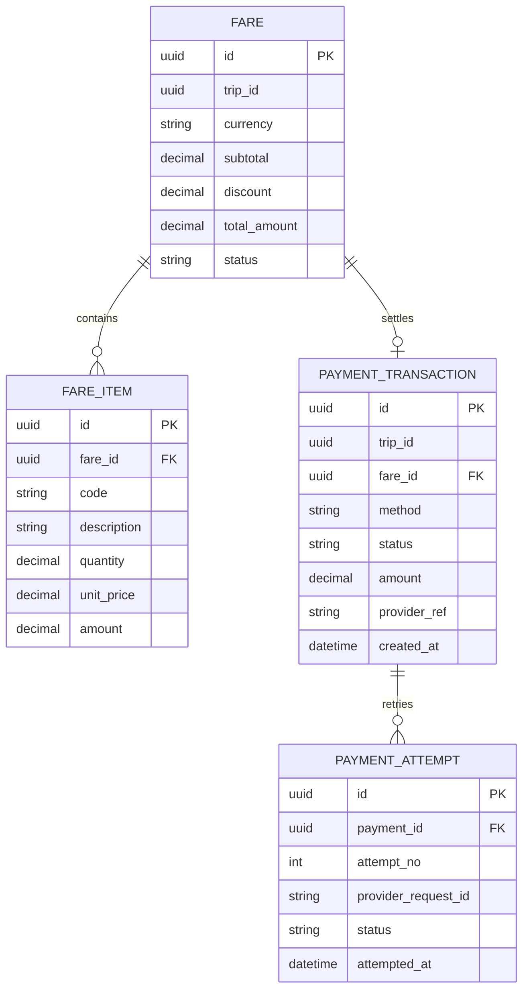

### Event publish

`FareCalculated`, `PaymentInitiated`, `PaymentSucceeded`, `PaymentFailed`, `PaymentRetried`.

---

## 46.8. BC08 – Notification → `notification-service`

### Làm gì?

- Subscribe các integration event cần thông báo.
- Chọn recipient/template/channel.
- Tạo notification và delivery attempt.
- Retry khi provider lỗi.
- Theo dõi trạng thái delivery.

### FR liên quan

`FR14`.

### Workflow phục vụ

`W06`, đồng thời là supporting step cho `W02–W05` và `W07`.

### Bảng ngôn ngữ thống nhất

| Thuật ngữ | Định nghĩa | Động từ chuẩn | Không dùng thay cho |
|---|---|---|---|
| Notification | Một yêu cầu gửi thông tin | compose, send | Domain event |
| Recipient | Người nhận | resolve | Customer entity |
| Template | Mẫu thông điệp | render | Business rule |
| Channel | Kênh gửi | select | RideType |
| DeliveryAttempt | Lần gửi cụ thể | send, retry | Notification |

### API chính

| Method | Endpoint | Mục đích |
|---|---|---|
| POST | `/internal/v1/notifications` | Tạo notification từ event |
| GET | `/api/v1/notifications/{notificationId}` | Xem notification |
| GET | `/api/v1/users/{userId}/notifications` | Danh sách notification |
| POST | `/internal/v1/notifications/{id}/retry` | Retry delivery |
| PATCH | `/api/v1/notifications/{id}/read` | Đánh dấu đã đọc |
| GET | `/internal/v1/templates/{code}` | Lấy template |

### Database: `notification_db`

| Table | Cột chính | Ý nghĩa |
|---|---|---|
| `notifications` | `id`, `recipient_id`, `event_type`, `template_code`, `status`, `created_at` | Notification |
| `notification_payloads` | `notification_id`, `payload_json` | Dữ liệu render |
| `delivery_attempts` | `id`, `notification_id`, `channel`, `provider`, `status`, `attempted_at` | Delivery |
| `templates` | `id`, `code`, `channel`, `content_template`, `active` | Template |

### ERD

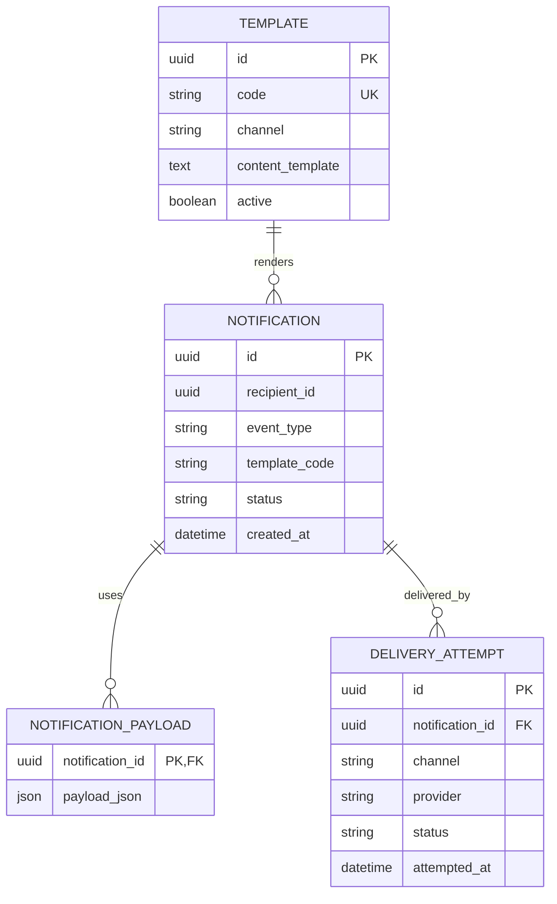

### Event publish

`NotificationCreated`, `NotificationSent`, `NotificationDeliveryFailed`.

---

## 46.9. BC09 – Feedback & Rating → `feedback-service`

### Làm gì?

- Kiểm tra customer có quyền đánh giá trip hay không.
- Nhận score/comment.
- Chống đánh giá trùng theo policy.
- Phát event phục vụ analytics.

### FR liên quan

`FR15`.

### Workflow phục vụ

`W07 – Đánh giá tài xế`.

### Bảng ngôn ngữ thống nhất

| Thuật ngữ | Định nghĩa | Động từ chuẩn | Không dùng thay cho |
|---|---|---|---|
| Rating | Đánh giá định lượng gắn với trip | submit, update | MatchScore của Dispatch |
| ReviewEligibility | Điều kiện được đánh giá | check | Payment eligibility |
| Score | Điểm đánh giá | validate | MatchScore |
| Comment | Nhận xét văn bản | add, edit | Notification content |

### API chính

| Method | Endpoint | Mục đích |
|---|---|---|
| GET | `/api/v1/reviews/eligibility?tripId=...` | Kiểm tra điều kiện |
| POST | `/api/v1/ratings` | Gửi rating |
| GET | `/api/v1/ratings/{ratingId}` | Xem rating |
| PATCH | `/api/v1/ratings/{ratingId}` | Sửa rating theo policy |
| GET | `/api/v1/drivers/{driverId}/ratings/summary` | Tổng hợp điểm cho đọc |

### Database: `feedback_db`

| Table | Cột chính | Ý nghĩa |
|---|---|---|
| `driver_ratings` | `id`, `trip_id`, `customer_id`, `driver_id`, `score`, `comment`, `status`, `created_at` | Rating aggregate |
| `review_eligibility` | `trip_id`, `customer_id`, `eligible`, `expires_at`, `rated_at` | Quyền đánh giá |

### ERD

```mermaid
erDiagram
    REVIEW_ELIGIBILITY ||--o| DRIVER_RATING : results_in

    REVIEW_ELIGIBILITY {
        uuid trip_id PK
        uuid customer_id
        boolean eligible
        datetime expires_at
        datetime rated_at
    }
    DRIVER_RATING {
        uuid id PK
        uuid trip_id UK
        uuid customer_id
        uuid driver_id
        int score
        text comment
        string status
        datetime created_at
    }
```

### Event publish

`RatingSubmitted`, `RatingUpdated`.

---

## 46.10. BC10 – Operations & Analytics → `operations-analytics-service`

### Làm gì?

- Tra cứu dữ liệu vận hành.
- Theo dõi incident.
- Tra cứu lịch sử giao dịch qua projection.
- Xây báo cáo doanh thu, số chuyến, hiệu suất tài xế.
- Không sở hữu source-of-truth transaction data của các domain khác.

### FR liên quan

`FR16, FR17`; áp dụng `FR18, FR19` cho authorization/security.

### Workflow phục vụ

`W08 – Vận hành và báo cáo`.

### Bảng ngôn ngữ thống nhất

| Thuật ngữ | Định nghĩa | Động từ chuẩn | Không dùng thay cho |
|---|---|---|---|
| Projection | Read model dựng từ event | rebuild, query | Domain aggregate |
| OperationalCase | Vấn đề cần vận hành xử lý | open, assign, resolve | Ticket của customer |
| Metric | Chỉ số tổng hợp | calculate, read | Raw transaction |
| Report | Báo cáo theo kỳ | generate, export | Projection |
| Incident | Sự cố cần điều tra | investigate, resolve | Trip state |

### API chính

| Method | Endpoint | Mục đích |
|---|---|---|
| GET | `/api/v1/ops/trips` | Tra cứu chuyến |
| GET | `/api/v1/ops/drivers` | Tra cứu tài xế |
| GET | `/api/v1/ops/customers` | Tra cứu khách |
| GET | `/api/v1/ops/payments` | Tra cứu giao dịch |
| GET | `/api/v1/ops/metrics/daily` | KPI ngày |
| GET | `/api/v1/ops/reports/revenue` | Báo cáo doanh thu |
| GET | `/api/v1/ops/reports/driver-performance` | Báo cáo hiệu suất driver |
| POST | `/api/v1/ops/incidents` | Tạo incident |
| PATCH | `/api/v1/ops/incidents/{incidentId}` | Cập nhật incident |

### Database: `operations_db`

Đây là **read database/projection database**, không phải transaction database của các BC khác.

| Table | Cột chính | Nguồn event chính | Ý nghĩa |
|---|---|---|---|
| `trip_projection` | `trip_id`, `customer_id`, `driver_id`, `status`, `distance_km`, `completed_at` | Trip | Tra cứu chuyến |
| `driver_projection` | `driver_id`, `vehicle_type`, `availability`, `last_position_at` | Driver-Fleet | Tra cứu driver |
| `payment_projection` | `payment_id`, `trip_id`, `amount`, `method`, `status`, `paid_at` | Billing | Tra cứu thanh toán |
| `rating_projection` | `rating_id`, `trip_id`, `driver_id`, `score`, `created_at` | Feedback | Hiệu suất driver |
| `daily_metrics` | `metric_date`, `completed_trips`, `revenue`, `avg_rating` | Nhiều event | KPI |
| `operational_incidents` | `id`, `type`, `severity`, `status`, `opened_at`, `resolved_at` | Operations | Incident |

### ERD

```mermaid
erDiagram
    TRIP_PROJECTION {
        uuid trip_id PK
        uuid customer_id
        uuid driver_id
        string status
        decimal distance_km
        datetime completed_at
    }
    DRIVER_PROJECTION {
        uuid driver_id PK
        string vehicle_type
        string availability
        datetime last_position_at
    }
    PAYMENT_PROJECTION {
        uuid payment_id PK
        uuid trip_id
        decimal amount
        string method
        string status
        datetime paid_at
    }
    RATING_PROJECTION {
        uuid rating_id PK
        uuid trip_id
        uuid driver_id
        int score
        datetime created_at
    }
    DAILY_METRIC {
        date metric_date PK
        int completed_trips
        decimal revenue
        decimal avg_rating
    }
    OPERATIONAL_INCIDENT {
        uuid id PK
        string type
        string severity
        string status
        datetime opened_at
        datetime resolved_at
    }
```

### Event subscription

Operations subscribe tối thiểu:

- `RideRequestSubmitted`, `RideRequestCancelled`
- `DriverBecameReady`, `DriverWentOffline`, `DriverPositionUpdated`
- `DriverAssigned`
- `TripCreated`, `TripStatusChanged`, `TripCompleted`, `TripCancelled`
- `FareCalculated`, `PaymentSucceeded`, `PaymentFailed`
- `RatingSubmitted`

---

# 47. NGUYÊN TẮC THIẾT KẾ MỖI MICROSERVICE

## 47.1. Database-per-Service

```text
identity-service          -> identity_db
customer-service          -> customer_db
driver-fleet-service      -> driver_fleet_db
ride-booking-service      -> ride_booking_db
dispatch-service          -> dispatch_db
trip-service              -> trip_db
billing-payment-service   -> billing_db
notification-service      -> notification_db
feedback-service          -> feedback_db
operations-analytics-service -> operations_db
```

Không tạo:

```text
shared_cab_db.customer
shared_cab_db.driver
shared_cab_db.trip
```

vì như vậy Boundary bị phá vỡ.

## 47.2. Cross-service reference

Cho phép lưu:

```text
customer-service.customer.user_id = UUID của identity-service
trip-service.trip.driver_id       = UUID của driver-fleet-service
dispatch-service.candidate.driver_id = UUID của driver-fleet-service
billing-service.fare.trip_id      = UUID của trip-service
feedback-service.rating.trip_id   = UUID của trip-service
```

Nhưng các UUID này là **External Reference**, không phải cross-database FK.

## 47.3. API Gateway / BFF

Frontend không nên gọi thẳng tất cả microservice.

```text
Mobile/Web
    |
    v
API Gateway / BFF
    |
    +--> identity-service
    +--> customer-service
    +--> ride-booking-service
    +--> trip-service
    +--> feedback-service
    +--> notification-service

Service-to-service
    |
    +--> dispatch-service
    +--> driver-fleet-service
    +--> billing-payment-service
```

## 47.4. Sync API và Async Event

| Tình huống | Cơ chế |
|---|---|
| Frontend cần response ngay | REST/HTTP |
| Service hỏi dữ liệu snapshot hiện tại | REST nội bộ |
| Thông báo “đã xảy ra” | Integration Event |
| Đồng bộ read model | Event |
| Payment provider callback | Webhook |
| Retry xử lý sự kiện | Message broker + idempotency |

---

# 48. CONTEXT MAP – MICROSERVICE CONTRACT

```mermaid
flowchart LR
    IAM[identity-service]
    CUS[customer-service]
    DRI[driver-fleet-service]
    BOOK[ride-booking-service]
    DISP[dispatch-service]
    TRIP[trip-service]
    BILL[billing-payment-service]
    NOTI[notification-service]
    RATE[feedback-service]
    OPS[operations-analytics-service]
    PG[Payment Provider]
    NP[Push/SMS/Email Provider]

    IAM -->|UserRegistered / identity| CUS
    BOOK -->|RideRequestSubmitted| DISP
    DRI -->|Ready / Position snapshot| DISP
    DISP -->|DriverAssigned| TRIP
    TRIP -->|TripCompleted| BILL
    TRIP -->|TripCompleted| RATE
    TRIP -->|TripStatusChanged| NOTI
    BILL -->|PaymentSucceeded / Failed| NOTI
    RATE -->|RatingSubmitted| OPS
    DRI -->|Driver events| OPS
    BOOK -->|Booking events| OPS
    DISP -->|Dispatch events| OPS
    TRIP -->|Trip events| OPS
    BILL -->|Billing events| OPS
    CUS -->|Customer events| OPS
    IAM -.->|AuthN/AuthZ| OPS
    BILL -->|ACL + Adapter| PG
    NOTI -->|ACL + Adapter| NP
```

---

# 49. API OWNERSHIP VÀ EVENT OWNERSHIP

| Business action | API owner | Event owner | Consumer chính |
|---|---|---|---|
| Login | identity-service | identity-service | BFF/API Gateway |
| Update customer profile | customer-service | customer-service | Ride Booking, Operations |
| Set driver Ready | driver-fleet-service | driver-fleet-service | Dispatch, Operations |
| Create ride request | ride-booking-service | ride-booking-service | Dispatch, Operations |
| Select driver | dispatch-service | dispatch-service | Trip, Notification, Operations |
| Start/complete trip | trip-service | trip-service | Billing, Feedback, Notification, Operations |
| Calculate fare | billing-payment-service | billing-payment-service | Customer/BFF, Operations |
| Send notification | notification-service | notification-service | Customer/Driver clients |
| Submit rating | feedback-service | feedback-service | Operations |
| Generate report | operations-analytics-service | operations-analytics-service | Operator/Admin |

---

# 50. QUY TẮC ERD VÀ TRANSACTION CHO MICROSERVICE

## 50.1. Không có transaction ACID xuyên 2 database

Không làm:

```text
BEGIN TRANSACTION
  insert trip_db.trips
  insert billing_db.payments
COMMIT
```

Thay bằng:

```text
Trip Service
   |
   | local transaction
   v
trip_db
   |
   | publish TripCompleted
   v
Message Broker
   |
   v
Billing Service
   |
   | local transaction
   v
billing_db
```

## 50.2. Outbox Pattern

Các service quan trọng nên có bảng:

```text
outbox_events
-------------------------
id
aggregate_type
aggregate_id
event_type
payload_json
occurred_at
published_at
```

Flow:

```text
Domain change + Outbox insert
          |
          v
      Local DB commit
          |
          v
      Outbox Publisher
          |
          v
      Message Broker
```

Điều này tránh trường hợp database commit thành công nhưng event không được publish.

## 50.3. Inbox / Idempotency

Các consumer của `TripCompleted`, `PaymentSucceeded`, `RatingSubmitted` nên lưu:

```text
inbox_messages
-------------------------
event_id PK
consumer_name
received_at
processed_at
status
```

Nếu event gửi lại cùng `event_id`, consumer không được xử lý nghiệp vụ lần hai.

---

# 51. TRACEABILITY CUỐI – BC ↔ FR ↔ WORKFLOW ↔ MICROSERVICE

| FR | Nội dung | BC chính | Microservice | Workflow |
|---|---|---|---|---|
| FR01 | Quản lý tài khoản | Identity + Customer | `identity-service`, `customer-service` | W01 |
| FR02 | Xác định vị trí khách hàng | Ride Booking | `ride-booking-service` | W02 |
| FR03 | Xác định điểm đón | Ride Booking | `ride-booking-service` | W02 |
| FR04 | Xác định điểm đến | Ride Booking | `ride-booking-service` | W02 |
| FR05 | Tìm tài xế sẵn có | Driver & Fleet + Dispatch | `driver-fleet-service`, `dispatch-service` | W03 |
| FR06 | Lọc theo loại xe | Dispatch | `dispatch-service` | W03 |
| FR07 | Tính khoảng cách | Dispatch | `dispatch-service` | W03 |
| FR08 | Phân công tài xế | Dispatch | `dispatch-service` | W03 |
| FR09 | Xử lý từ chối | Dispatch | `dispatch-service` | W03 |
| FR10 | Theo dõi chuyến | Trip Execution | `trip-service` | W04 |
| FR11 | Cập nhật trạng thái chuyến | Trip Execution | `trip-service` | W04 |
| FR12 | Tính cước | Billing | `billing-payment-service` | W05 |
| FR13 | Thanh toán | Billing & Payment | `billing-payment-service` | W05 |
| FR14 | Thông báo | Notification | `notification-service` | W06 |
| FR15 | Đánh giá tài xế | Feedback | `feedback-service` | W07 |
| FR16 | Quản lý vận hành | Operations + Owner APIs | `operations-analytics-service` | W08 |
| FR17 | Báo cáo | Operations & Analytics | `operations-analytics-service` | W08 |
| FR18 | Phân quyền | Identity & Access | `identity-service` | W01, W08 |
| FR19 | Bảo mật | Identity + all services | `identity-service` + service security | W01–W08 |

---

# 52. MẪU CẤU TRÚC SOURCE CODE CHO TỪNG MICROSERVICE

Mỗi service giữ DDD structure riêng:

```text
<service-name>/
├── src/
│   ├── Domain/
│   │   ├── Entities/
│   │   ├── ValueObjects/
│   │   ├── Aggregates/
│   │   ├── DomainServices/
│   │   ├── Events/
│   │   ├── Repositories/
│   │   └── Policies/
│   ├── Application/
│   │   ├── Commands/
│   │   ├── Queries/
│   │   ├── Handlers/
│   │   └── DTOs/
│   ├── Infrastructure/
│   │   ├── Persistence/
│   │   ├── Messaging/
│   │   ├── ExternalAdapters/
│   │   └── Configuration/
│   └── Interfaces/
│       ├── Http/
│       ├── Consumers/
│       └── Webhooks/
└── tests/
    ├── Domain/
    ├── Application/
    └── Integration/
```

### Mapping nhanh

```text
BC01 -> identity-service
BC02 -> customer-service
BC03 -> driver-fleet-service
BC04 -> ride-booking-service
BC05 -> dispatch-service
BC06 -> trip-service
BC07 -> billing-payment-service
BC08 -> notification-service
BC09 -> feedback-service
BC10 -> operations-analytics-service
```

---

# 53. KẾT LUẬN BỔ SUNG

Thiết kế sau khi bổ sung đáp ứng 4 mức traceability liên tiếp:

```text
Functional Requirement (FR)
          ↓
Bounded Context
          ↓
Business Process / Workflow
          ↓
Microservice + API + Database + ERD
```

Ví dụ với `FR08 – Phân công tài xế`:

```text
FR08
 ↓
BC05 – Dispatch
 ↓
W03 – Tìm và phân công tài xế
 ↓
dispatch-service
 ↓
POST /internal/v1/dispatch-jobs
POST /internal/v1/assignment-offers/{id}/accept
 ↓
dispatch_db
 ├── dispatch_jobs
 ├── dispatch_candidates
 └── assignment_offers
```

Ví dụ với `FR12 – Tính cước`:

```text
FR12
 ↓
BC07 – Billing & Payment
 ↓
W05 – Tính cước và thanh toán
 ↓
billing-payment-service
 ↓
POST /internal/v1/fares/calculate
 ↓
billing_db
 ├── fares
 └── fare_items
```

Do đó, **mỗi Bounded Context đã có đủ 7 thông tin để triển khai**:

1. Boundary và trách nhiệm nghiệp vụ.
2. FR liên quan.
3. Workflow/Business Process phục vụ.
4. Ubiquitous Language riêng.
5. Microservice tương ứng.
6. API/contract tương ứng.
7. Database và ERD riêng.

> Phần bảo dưỡng/sửa chữa xuất hiện ở cuối `srs.md` vẫn được giữ ngoài 10 BC CAB này vì nó không thuộc workflow đặt xe hiện tại. Nếu đề tài sau này mở rộng thêm Garage/Maintenance, phần đó nên được thiết kế thành một Bounded Context mới với microservice, database và Ubiquitous Language riêng, không nhập vào `driver-fleet-service`.
