# DDD – BOUNDED CONTEXT & MICROSERVICE CHO CAB SYSTEM

> Repository tham chiếu: https://github.com/ggiathinh65-debug/23671881_VuGiaThinh_Cabsystem  
> Snapshot: 23/09/2026  
> Mục tiêu: tổng hợp thiết kế DDD từ `srs.md`, giữ đủ các yêu cầu: **Bounded Context, Ubiquitous Language riêng, FR, Business Process Model/Workflow, Aggregate, Microservice, API, Database, ERD, Database Type, lý do kỹ thuật, Domain Events**.

---

## 1. Kiến trúc tổng thể

CAB được chia thành **10 Bounded Context**, mỗi BC có model và ngôn ngữ nghiệp vụ riêng, sau đó triển khai thành **1 Microservice + 1 Database ownership**.

| BC | Bounded Context | Microservice | Vai trò | FR chính | Workflow chính |
|---|---|---|---|---|---|
| BC01 | Identity & Access | `identity-service` | Xác thực, phân quyền | FR01, FR18, FR19 | W01, W08 |
| BC02 | Customer Management | `customer-service` | Hồ sơ khách hàng | FR01, FR16 | W01, W02, W07, W08 |
| BC03 | Driver & Fleet | `driver-fleet-service` | Tài xế, xe, availability, vị trí | FR05, FR06, FR10, FR16 | W03, W04, W08 |
| BC04 | Ride Booking | `ride-booking-service` | Tạo/quản lý yêu cầu đặt xe | FR02, FR03, FR04 | W02 |
| BC05 | Dispatch | `dispatch-service` | Tìm và phân công tài xế | FR05–FR09 | W03 |
| BC06 | Trip Execution & Tracking | `trip-service` | Vòng đời chuyến và tracking | FR10, FR11 | W04 |
| BC07 | Billing & Payment | `billing-payment-service` | Tính cước, thanh toán | FR12, FR13 | W05 |
| BC08 | Notification | `notification-service` | Gửi thông báo | FR14 | W02–W07 |
| BC09 | Feedback & Rating | `feedback-service` | Đánh giá tài xế | FR15 | W07 |
| BC10 | Operations & Analytics | `operations-analytics-service` | Vận hành, tra cứu, báo cáo | FR16, FR17, FR18, FR19 | W08 |

### Core flow

```text
Customer
   ↓
Ride Booking
   ↓ RideRequestSubmitted
Dispatch ← Driver & Fleet
   ↓ DriverAssigned
Trip Execution & Tracking
   ├──→ Billing & Payment
   ├──→ Feedback & Rating
   └──→ Notification / Operations
```

### Nguyên tắc Boundary

- Không dùng chung Entity/domain model giữa các BC.
- Không truy cập trực tiếp DB của BC khác.
- Chỉ chia sẻ **ID, DTO/contract, API hoặc Integration Event**.
- Một từ có thể có nghĩa khác giữa các BC; không ép dùng cùng một model.
- `Operations & Analytics` chỉ làm owner của read model/reporting, không sửa source-of-truth của Core Domain.

---

# 2. Business Process Model (BPM) / Workflow

## W01 – Đăng ký / Đăng nhập / Xác thực
**FR:** FR01, FR18, FR19  
**BC:** BC01, BC02

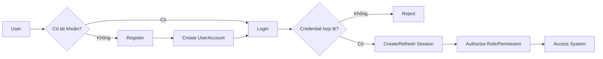

## W02 – Đặt xe
**FR:** FR02, FR03, FR04  
**BC:** BC02, BC04, BC08

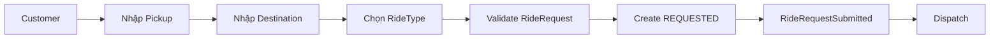

## W03 – Tìm và phân công tài xế
**FR:** FR05–FR09  
**BC:** BC03, BC05, BC08

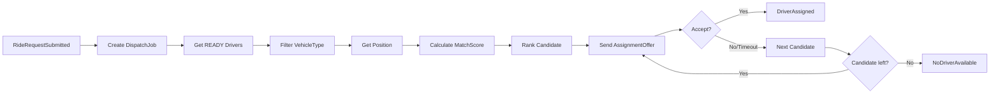

## W04 – Thực hiện và theo dõi chuyến
**FR:** FR10, FR11  
**BC:** BC03, BC06, BC08

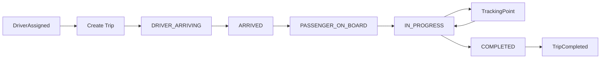

## W05 – Tính cước và thanh toán
**FR:** FR12, FR13  
**BC:** BC07, BC08

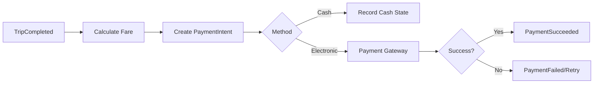

## W06 – Gửi thông báo
**FR:** FR14  
**BC:** BC08

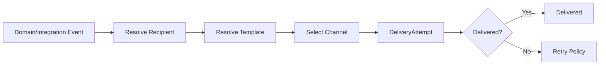

## W07 – Đánh giá tài xế
**FR:** FR15  
**BC:** BC09

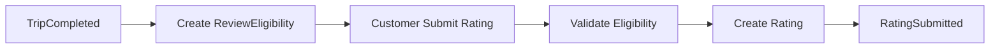

## W08 – Vận hành và báo cáo
**FR:** FR16, FR17, áp dụng FR18, FR19  
**BC:** BC01, BC02, BC03, BC10

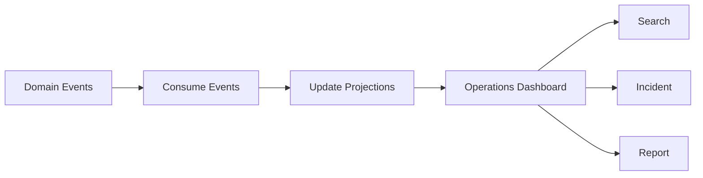

---

# 3. CHI TIẾT TỪNG BOUNDED CONTEXT

> **Template cố định:** Mục đích BC → FR liên quan → Workflow → Ubiquitous Language → Aggregate → Microservice → API chính → Database → ERD → Database Type → Giải thích lý do kỹ thuật → Domain Events.

---

## BC01 – Identity & Access

### 1. Mục đích BC
Quản lý danh tính đăng nhập, credential, role, permission và session. Không quản lý nghiệp vụ Customer/Driver/Trip.

### 2. FR liên quan
`FR01, FR18, FR19`

### 3. Workflow
`W01`, hỗ trợ authorization trong `W08`.

### 4. Ubiquitous Language

| Thuật ngữ | Nghĩa trong BC | Động từ |
|---|---|---|
| UserAccount | Danh tính đăng nhập | register, disable |
| Credential | Thông tin xác thực | authenticate, change |
| Role | Nhóm quyền | assignRole |
| Permission | Quyền thao tác | authorize |
| Session | Phiên đăng nhập | create, revoke |

**Không dùng `UserAccount` thay cho `Customer`, `Driver`.**

### 5. Aggregate
`UserAccount` (Root); `Session` là entity phụ.  
VO: `UserId`, `Username`, `PasswordHash`, `RoleName`, `PermissionCode`, `SessionId`.  
Invariant: username/email duy nhất; account disabled không tạo session mới.

### 6. Microservice
`identity-service`

### 7. API chính
| Method | API | Mục đích |
|---|---|---|
| POST | `/api/v1/auth/register` | Đăng ký |
| POST | `/api/v1/auth/login` | Đăng nhập |
| POST | `/api/v1/auth/refresh` | Refresh token |
| POST | `/api/v1/auth/logout` | Logout/revoke |
| GET | `/api/v1/users/{userId}/permissions` | Lấy quyền |
| PATCH | `/api/v1/users/{userId}/status` | Enable/disable |

### 8. Database
`identity_db`

| Table | Cột chính |
|---|---|
| `user_accounts` | `id, username, email, password_hash, status` |
| `roles` | `id, code, name` |
| `permissions` | `id, code, name` |
| `user_roles` | `user_id, role_id` |
| `role_permissions` | `role_id, permission_id` |
| `sessions` | `id, user_id, refresh_token_hash, expires_at` |

### 9. ERD
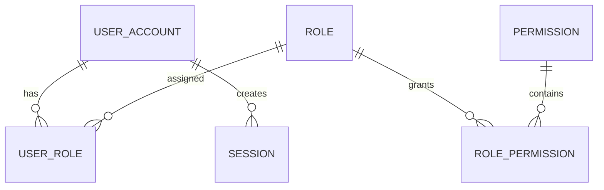

### 10. Database Type
**PostgreSQL**; Redis có thể dùng làm session/token cache.

### 11. Giải thích lý do kỹ thuật
Dữ liệu credential/role cần ACID, uniqueness và transaction rõ ràng. PostgreSQL làm source-of-truth; Redis chỉ tối ưu session/cache, không giữ credential gốc.

### 12. Domain Events
| Event | Khi nào |
|---|---|
| `UserRegistered` | Tạo tài khoản thành công |
| `UserAuthenticated` | Đăng nhập hợp lệ |
| `UserDisabled` | Tài khoản bị vô hiệu hóa |

---

## BC02 – Customer Management

### 1. Mục đích BC
Quản lý hồ sơ nghiệp vụ Customer, contact và trạng thái sử dụng dịch vụ. Không quản lý credential.

### 2. FR liên quan
`FR01` (profile), `FR16`.

### 3. Workflow
`W01, W02, W07, W08`.

### 4. Ubiquitous Language

| Thuật ngữ | Nghĩa trong BC | Động từ |
|---|---|---|
| Customer | Người sử dụng CAB | create, suspend |
| CustomerProfile | Hồ sơ nghiệp vụ | updateProfile |
| ContactInfo | Liên hệ | changeContact |
| CustomerStatus | Trạng thái sử dụng dịch vụ | suspend, restore |

**Không dùng `Customer` thay cho `UserAccount`.**

### 5. Aggregate
`Customer` Root; entity: `CustomerContact`, `CustomerStatusHistory`; VO: `CustomerId`, `ContactInfo`, `CustomerStatus`.  
Invariant: `userId` là external reference hợp lệ; contact chính duy nhất; status chuyển theo policy.

### 6. Microservice
`customer-service`

### 7. API chính
| Method | API | Mục đích |
|---|---|---|
| POST | `/api/v1/customers` | Tạo profile |
| GET | `/api/v1/customers/{customerId}` | Xem profile |
| PATCH | `/api/v1/customers/{customerId}` | Cập nhật |
| PATCH | `/api/v1/customers/{customerId}/status` | Suspend/restore |
| GET | `/api/v1/customers/{customerId}/service-eligibility` | Kiểm tra điều kiện |

### 8. Database
`customer_db`

| Table | Cột chính |
|---|---|
| `customers` | `id, user_id, full_name, status` |
| `customer_contacts` | `id, customer_id, phone, email, is_primary` |
| `customer_status_history` | `id, customer_id, old_status, new_status, changed_at` |

### 9. ERD
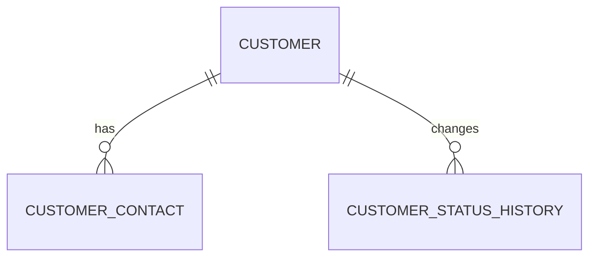

### 10. Database Type
**PostgreSQL.**

### 11. Giải thích lý do kỹ thuật
Profile/contact/history là dữ liệu quan hệ, cần transaction và constraint. `user_id` chỉ là ID tham chiếu, không có FK xuyên DB.

### 12. Domain Events
`CustomerCreated`, `CustomerProfileUpdated`, `CustomerSuspended`.

---

## BC03 – Driver & Fleet

### 1. Mục đích BC
Quản lý driver, vehicle, availability và vị trí hoạt động; cung cấp dữ liệu cho Dispatch và Trip.

### 2. FR liên quan
`FR05, FR06, FR10, FR16`.

### 3. Workflow
`W03, W04, W08`.

### 4. Ubiquitous Language

| Thuật ngữ | Nghĩa trong BC | Động từ |
|---|---|---|
| Driver | Nguồn lực tài xế | register, update |
| Vehicle | Phương tiện | registerVehicle |
| Availability | Khả năng nhận chuyến | becomeReady, becomeBusy |
| DriverPosition | Vị trí gần nhất | updatePosition |
| Ready | Có thể nhận assignment | markReady |

### 5. Aggregate
`Driver` Root; `Vehicle` quản lý vòng đời xe.  
VO: `DriverId`, `VehicleId`, `LicenseNo`, `PlateNumber`, `GeoPoint`, `VehicleType`.  
Invariant: chỉ driver đủ điều kiện mới `READY`; vehicle không active cho hai driver tại cùng thời điểm.

### 6. Microservice
`driver-fleet-service`

### 7. API chính
| Method | API | Mục đích |
|---|---|---|
| POST | `/api/v1/drivers` | Tạo driver |
| POST | `/api/v1/drivers/{driverId}/vehicles` | Đăng ký xe |
| PATCH | `/api/v1/drivers/{driverId}/availability` | Đổi availability |
| POST | `/api/v1/drivers/{driverId}/positions` | Cập nhật vị trí |
| GET | `/api/v1/drivers/available` | Tìm driver READY |
| POST | `/api/v1/drivers/{driverId}/reserve` | Reserve driver |

### 8. Database
`driver_fleet_db`

| Table | Cột chính |
|---|---|
| `drivers` | `id, user_id, license_no, status` |
| `vehicles` | `id, plate_no, vehicle_type, status` |
| `driver_vehicles` | `driver_id, vehicle_id, from_at, to_at` |
| `driver_availability` | `driver_id, status, updated_at` |
| `driver_positions` | `id, driver_id, lat, lng, recorded_at` |

### 9. ERD
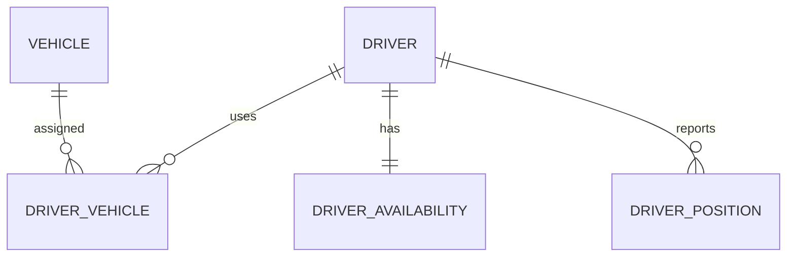

### 10. Database Type
**PostgreSQL + Redis.**

### 11. Giải thích lý do kỹ thuật
Master data cần ACID nên nằm ở PostgreSQL. Availability/last position có tần suất đọc-ghi cao, Redis giảm latency cho Dispatch.

### 12. Domain Events
`DriverBecameReady`, `DriverWentOffline`, `DriverPositionUpdated`, `VehicleRegistered`.

---

## BC04 – Ride Booking

### 1. Mục đích BC
Tạo và quản lý `RideRequest`: pickup, destination, ride type, trạng thái booking; sau khi submit phát event cho Dispatch.

### 2. FR liên quan
`FR02, FR03, FR04`.

### 3. Workflow
`W02`.

### 4. Ubiquitous Language

| Thuật ngữ | Nghĩa trong BC | Động từ |
|---|---|---|
| RideRequest | Nhu cầu đi xe chưa thực thi | request, cancel |
| Pickup | Điểm đón | setPickup |
| Destination | Điểm đến | setDestination |
| RideType | Loại xe/dịch vụ yêu cầu | selectRideType |
| RequestStatus | Trạng thái booking | submit, cancel |

**`RideRequest` khác `Trip`: request chưa phải chuyến thực thi.**

### 5. Aggregate
`RideRequest` Root; entities: location, status history; VO: `Pickup`, `Destination`, `GeoPoint`, `RideType`, `RequestStatus`.  
Invariant: pickup/destination hợp lệ; chỉ state cho phép mới sửa/hủy; submit chỉ phát event một lần.

### 6. Microservice
`ride-booking-service`

### 7. API chính
| Method | API | Mục đích |
|---|---|---|
| POST | `/api/v1/ride-requests` | Tạo booking |
| GET | `/api/v1/ride-requests/{rideRequestId}` | Xem booking |
| PATCH | `/api/v1/ride-requests/{rideRequestId}/destination` | Sửa destination |
| POST | `/api/v1/ride-requests/{rideRequestId}/cancel` | Hủy |
| GET | `/api/v1/customers/{customerId}/ride-requests` | Lịch sử |

### 8. Database
`ride_booking_db`

| Table | Cột chính |
|---|---|
| `ride_requests` | `id, customer_id, ride_type, status, requested_at` |
| `ride_request_locations` | `id, ride_request_id, location_type, lat, lng, address` |
| `ride_request_status_history` | `id, ride_request_id, from_status, to_status, changed_at` |

### 9. ERD
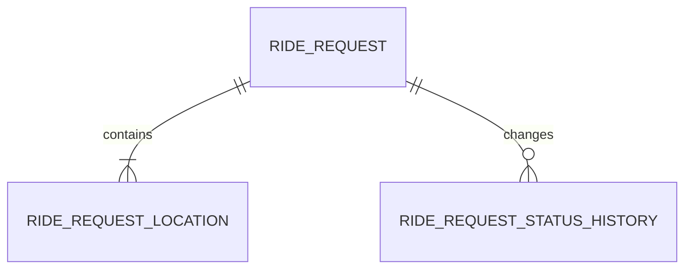

### 10. Database Type
**PostgreSQL.**

### 11. Giải thích lý do kỹ thuật
Booking là điểm vào Core Domain và cần tạo request + location + history nhất quán trong một transaction ACID.

### 12. Domain Events
`RideRequestSubmitted`, `RideRequestUpdated`, `RideRequestCancelled`.

---

## BC05 – Dispatch

### 1. Mục đích BC
Tìm, xếp hạng, offer, accept/reject/timeout và phân công driver cho RideRequest.

### 2. FR liên quan
`FR05, FR06, FR07, FR08, FR09`.

### 3. Workflow
`W03`.

### 4. Ubiquitous Language

| Thuật ngữ | Nghĩa trong BC | Động từ |
|---|---|---|
| DispatchJob | Công việc tìm driver | start, retry |
| Candidate | Driver đang được xét | rank, select |
| MatchScore | Điểm phù hợp để dispatch | calculate |
| AssignmentOffer | Lời mời nhận chuyến | offer, accept, reject |
| NoDriverAvailable | Không còn candidate phù hợp | failDispatch |

**`MatchScore` khác `Rating/Score` của Feedback.**

### 5. Aggregate
`DispatchJob` Root; entity: `AssignmentAttempt`; VO: `CandidateId`, `MatchScore`, `DispatchStatus`, `OfferExpiry`.  
Invariant: một request chỉ có một assignment active; candidate phải đạt eligibility; timeout/reject chuyển candidate tiếp theo.

### 6. Microservice
`dispatch-service`

### 7. API chính
| Method | API | Mục đích |
|---|---|---|
| POST | `/internal/v1/dispatch-jobs` | Tạo job |
| GET | `/internal/v1/dispatch-jobs/{dispatchJobId}` | Xem job |
| POST | `/internal/v1/assignment-offers/{offerId}/accept` | Accept |
| POST | `/internal/v1/assignment-offers/{offerId}/reject` | Reject |
| POST | `/internal/v1/assignment-offers/{offerId}/expire` | Expire |
| POST | `/internal/v1/dispatch-jobs/{dispatchJobId}/retry` | Retry |

### 8. Database
`dispatch_db`

| Table | Cột chính |
|---|---|
| `dispatch_jobs` | `id, ride_request_id, status, started_at, completed_at` |
| `dispatch_candidates` | `id, dispatch_job_id, driver_id, distance_km, match_score, rank_no` |
| `assignment_offers` | `id, dispatch_job_id, driver_id, status, offered_at, expires_at` |
| `dispatch_idempotency` | `key, dispatch_job_id, created_at` |

### 9. ERD
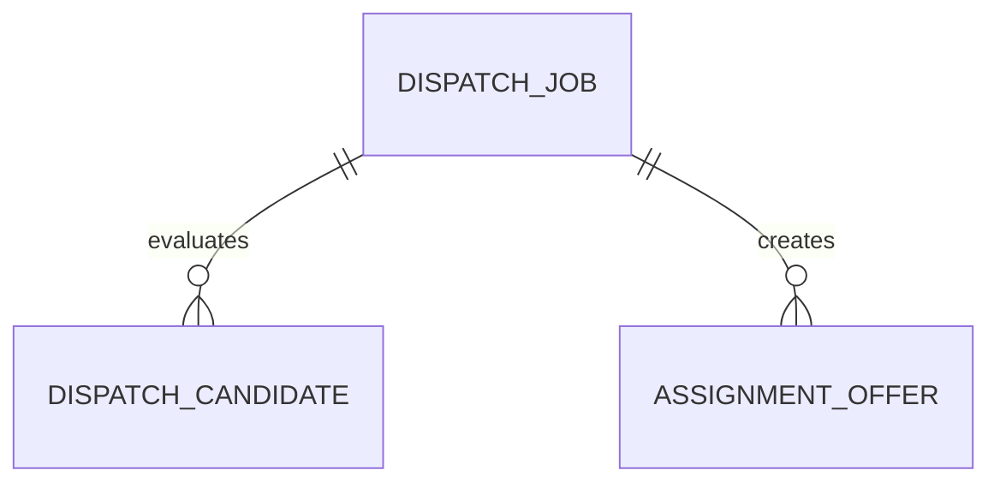

### 10. Database Type
**PostgreSQL + Redis.**

### 11. Giải thích lý do kỹ thuật
PostgreSQL lưu decision/audit; Redis phù hợp candidate cache, short-lived reservation/lock và workload có latency thấp.

### 12. Domain Events
`DispatchJobCreated`, `DriverOffered`, `DriverAssigned`, `NoDriverAvailable`.

---

## BC06 – Trip Execution & Tracking

### 1. Mục đích BC
Tạo Trip sau assignment, điều khiển state machine, ghi tracking và phát `TripCompleted`.

### 2. FR liên quan
`FR10, FR11`.

### 3. Workflow
`W04`.

### 4. Ubiquitous Language

| Thuật ngữ | Nghĩa trong BC | Động từ |
|---|---|---|
| Trip | Chuyến đang/đã thực thi | start, complete, cancel |
| TripStatus | Trạng thái vòng đời | transition |
| TrackingPoint | Vị trí theo thời gian | append |
| Completed | Chuyến hoàn tất thành công | complete |

**Không dùng `TripStatus` để biểu diễn `DriverAvailability`.**

### 5. Aggregate
`Trip` Root; entities: `TripStatusHistory`, `TrackingPoint`; VO: `TripId`, `TripStatus`, `GeoPoint`, `Distance`, `TripTime`.  
Invariant: state machine không nhảy trạng thái trái quy định; `TripCompleted` chỉ phát một lần.

### 6. Microservice
`trip-service`

### 7. API chính
| Method | API | Mục đích |
|---|---|---|
| POST | `/internal/v1/trips` | Tạo Trip |
| GET | `/api/v1/trips/{tripId}` | Xem chuyến |
| POST | `/api/v1/trips/{tripId}/arrive` | Arrive |
| POST | `/api/v1/trips/{tripId}/start` | Start trip |
| POST | `/api/v1/trips/{tripId}/positions` | Tracking |
| POST | `/api/v1/trips/{tripId}/complete` | Complete |

### 8. Database
`trip_db`

| Table | Cột chính |
|---|---|
| `trips` | `id, ride_request_id, customer_id, driver_id, status, distance_km, started_at, completed_at` |
| `trip_status_history` | `id, trip_id, from_status, to_status, changed_at` |
| `tracking_points` | `id, trip_id, lat, lng, recorded_at` |

### 9. ERD
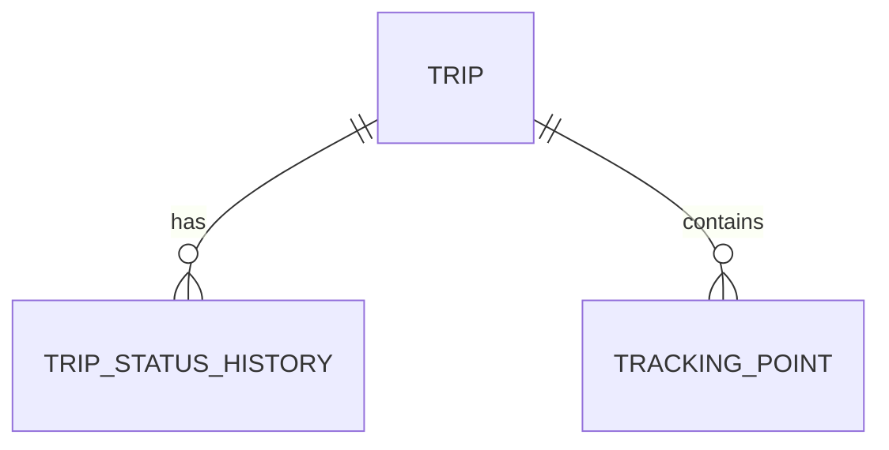

### 10. Database Type
**PostgreSQL + Time-series storage/TimescaleDB khi tracking lớn.**

### 11. Giải thích lý do kỹ thuật
Trip state cần ACID và audit. Tracking có đặc tính append theo thời gian và volume lớn nên có thể tách sang time-series khi hệ thống tăng quy mô.

### 12. Domain Events
`TripCreated`, `TripStatusChanged`, `TrackingPointRecorded`, `TripCompleted`.

---

## BC07 – Billing & Payment

### 1. Mục đích BC
Tính fare từ trip đã hoàn thành và quản lý payment transaction/callback/retry.

### 2. FR liên quan
`FR12, FR13`.

### 3. Workflow
`W05`.

### 4. Ubiquitous Language

| Thuật ngữ | Nghĩa trong BC | Động từ |
|---|---|---|
| Fare | Nghĩa vụ thanh toán của trip | calculate |
| FareItem | Thành phần giá | add, calculate |
| PaymentIntent | Yêu cầu bắt đầu thanh toán | create |
| PaymentTransaction | Giao dịch thanh toán | confirm, fail |
| PaymentAttempt | Một lần gọi provider | execute, retry |

**`Fare` khác `Trip`; `PaymentTransaction` khác `Fare`.**

### 5. Aggregate
`Fare` Root; `PaymentTransaction` quản lý vòng đời payment. VO: `Money`, `FareItem`, `PaymentMethod`, `PaymentStatus`.  
Invariant: `total = sum(items) - discount`; callback idempotent; transaction không quay từ `SUCCEEDED` về `FAILED`.

### 6. Microservice
`billing-payment-service`

### 7. API chính
| Method | API | Mục đích |
|---|---|---|
| POST | `/internal/v1/fares/calculate` | Tính fare |
| GET | `/api/v1/fares/{fareId}` | Xem fare |
| POST | `/api/v1/payments` | Tạo payment |
| GET | `/api/v1/payments/{paymentId}` | Xem payment |
| POST | `/api/v1/payments/{paymentId}/confirm` | Confirm |
| POST | `/api/v1/payment-provider/webhooks` | Callback provider |

### 8. Database
`billing_db`

| Table | Cột chính |
|---|---|
| `fares` | `id, trip_id, currency, subtotal, discount, total_amount, status` |
| `fare_items` | `id, fare_id, code, quantity, unit_price, amount` |
| `payment_transactions` | `id, trip_id, fare_id, method, status, amount, provider_ref` |
| `payment_attempts` | `id, payment_id, attempt_no, provider_request_id, status` |
| `payment_idempotency_keys` | `key, payment_id, created_at` |

### 9. ERD
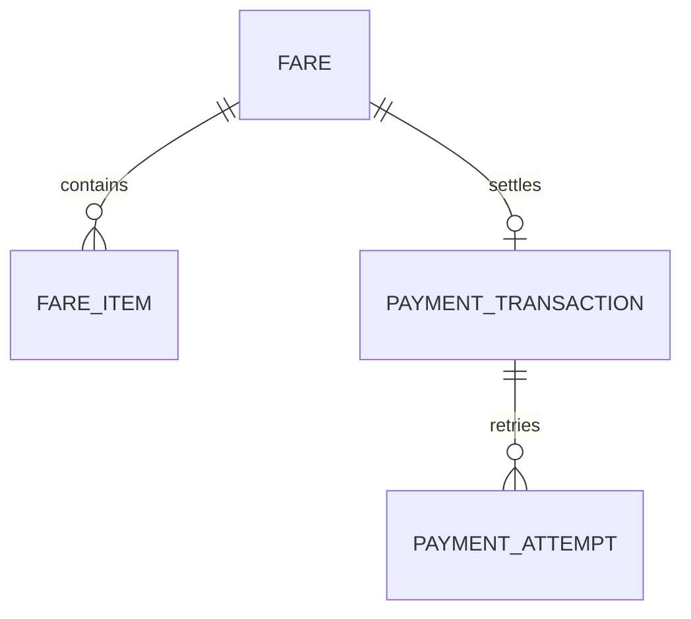

### 10. Database Type
**PostgreSQL.**

### 11. Giải thích lý do kỹ thuật
Đây là domain tài chính: ưu tiên ACID, audit và idempotency. Không dùng NoSQL làm source-of-truth cho payment transaction.

### 12. Domain Events
`FareCalculated`, `PaymentInitiated`, `PaymentSucceeded`, `PaymentFailed`.

---

## BC08 – Notification

### 1. Mục đích BC
Nhận event, resolve recipient/template/channel, tạo delivery attempt và retry khi provider lỗi.

### 2. FR liên quan
`FR14`.

### 3. Workflow
`W06`, hỗ trợ các bước thông báo trong `W02–W05, W07`.

### 4. Ubiquitous Language

| Thuật ngữ | Nghĩa trong BC | Động từ |
|---|---|---|
| Notification | Yêu cầu gửi thông tin | compose, send |
| Recipient | Người nhận | resolve |
| Template | Mẫu nội dung | render |
| Channel | Kênh gửi | select |
| DeliveryAttempt | Một lần gửi | send, retry |

**Notification không phải Domain Event.**

### 5. Aggregate
`Notification` Root; entity: `DeliveryAttempt`; VO: `Recipient`, `Channel`, `TemplateCode`, `DeliveryStatus`.  
Invariant: notification có recipient + template hợp lệ; retry không tạo trùng logical notification.

### 6. Microservice
`notification-service`

### 7. API chính
| Method | API | Mục đích |
|---|---|---|
| POST | `/internal/v1/notifications` | Tạo notification |
| GET | `/api/v1/notifications/{notificationId}` | Xem notification |
| GET | `/api/v1/users/{userId}/notifications` | Danh sách |
| POST | `/internal/v1/notifications/{id}/retry` | Retry |
| PATCH | `/api/v1/notifications/{id}/read` | Mark read |

### 8. Database
`notification_db`

| Table | Cột chính |
|---|---|
| `notifications` | `id, recipient_id, event_type, template_code, status` |
| `notification_payloads` | `notification_id, payload_json` |
| `delivery_attempts` | `id, notification_id, channel, provider, status, attempted_at` |
| `templates` | `id, code, channel, content_template, active` |

### 9. ERD
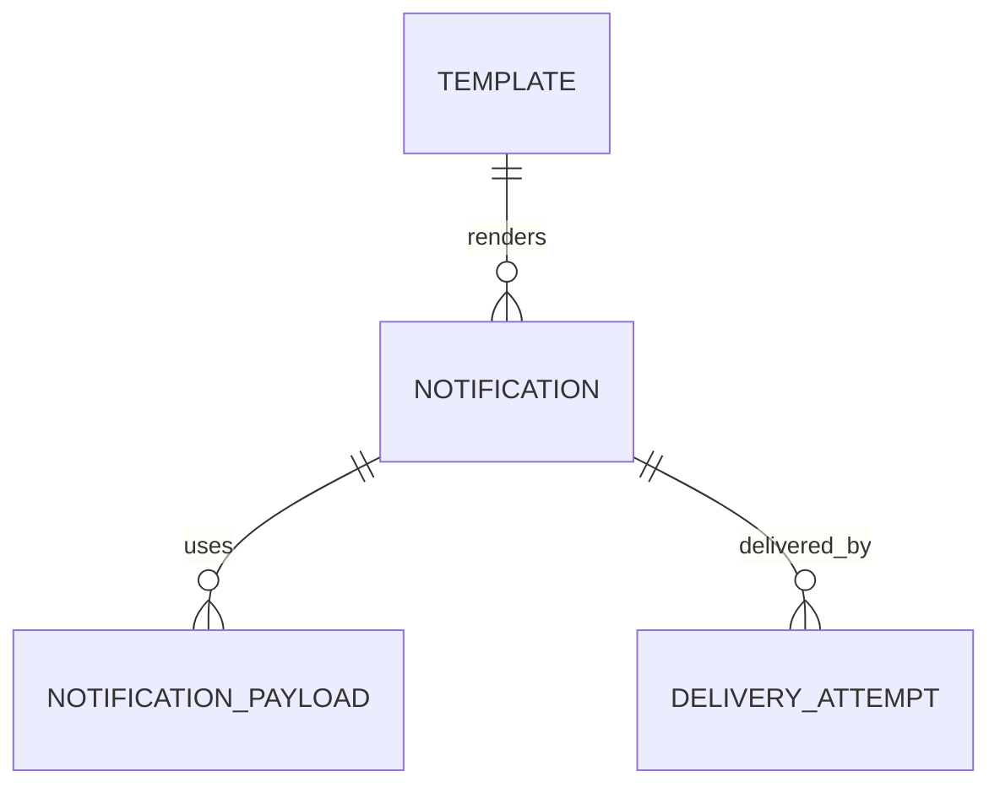

### 10. Database Type
**PostgreSQL + Redis.**

### 11. Giải thích lý do kỹ thuật
Notification có burst, retry và rate limit. PostgreSQL lưu trạng thái/delivery history; Redis hỗ trợ queue/dedup/rate-limit khi cần.

### 12. Domain Events
`NotificationCreated`, `NotificationSent`, `NotificationDeliveryFailed`.

---

## BC09 – Feedback & Rating

### 1. Mục đích BC
Kiểm tra eligibility và lưu rating/comment của customer đối với driver sau trip hoàn thành.

### 2. FR liên quan
`FR15`.

### 3. Workflow
`W07`.

### 4. Ubiquitous Language

| Thuật ngữ | Nghĩa trong BC | Động từ |
|---|---|---|
| Rating | Đánh giá gắn với trip | submit, update |
| ReviewEligibility | Quyền được đánh giá | check |
| Score | Điểm đánh giá | validate |
| Comment | Nhận xét | add, edit |

**`Score` ở đây khác `MatchScore` của Dispatch.**

### 5. Aggregate
`DriverRating` Root; entity: `ReviewEligibility`; VO: `Score`, `Comment`, `RatingStatus`.  
Invariant: chỉ eligible customer mới submit; một trip chỉ có một rating active; score phải nằm trong range policy.

### 6. Microservice
`feedback-service`

### 7. API chính
| Method | API | Mục đích |
|---|---|---|
| GET | `/api/v1/reviews/eligibility?tripId=...` | Check eligibility |
| POST | `/api/v1/ratings` | Gửi rating |
| GET | `/api/v1/ratings/{ratingId}` | Xem rating |
| PATCH | `/api/v1/ratings/{ratingId}` | Sửa rating |
| GET | `/api/v1/drivers/{driverId}/ratings/summary` | Tổng hợp rating |

### 8. Database
`feedback_db`

| Table | Cột chính |
|---|---|
| `driver_ratings` | `id, trip_id, customer_id, driver_id, score, comment, status` |
| `review_eligibility` | `trip_id, customer_id, eligible, expires_at, rated_at` |

### 9. ERD
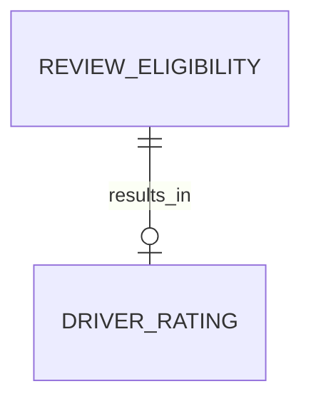

### 10. Database Type
**PostgreSQL.**

### 11. Giải thích lý do kỹ thuật
Rating cần uniqueness theo trip, transaction và aggregate query ổn định; PostgreSQL đáp ứng tốt hơn mô hình key-value đơn thuần.

### 12. Domain Events
`RatingSubmitted`, `RatingUpdated`.

---

## BC10 – Operations & Analytics

### 1. Mục đích BC
Tra cứu vận hành, incident, dashboard và báo cáo. Đây là **read/reporting context**, không sửa source-of-truth của các BC khác.

### 2. FR liên quan
`FR16, FR17`; áp dụng `FR18, FR19` cho authorization/security.

### 3. Workflow
`W08`.

### 4. Ubiquitous Language

| Thuật ngữ | Nghĩa trong BC | Động từ |
|---|---|---|
| Projection | Read model từ event | rebuild, query |
| OperationalCase | Ca xử lý vận hành | open, resolve |
| Metric | Chỉ số tổng hợp | calculate |
| Report | Báo cáo theo kỳ | generate, export |
| Incident | Sự cố vận hành | investigate, resolve |

**Không dùng Projection thay cho Aggregate của Core Domain.**

### 5. Aggregate
`OperationalCase` Root; projection entities phục vụ read; VO: `Severity`, `IncidentStatus`, `ReportPeriod`.  
Invariant: incident có lifecycle rõ ràng; projection có thể rebuild từ events; không ghi trực tiếp source DB của BC khác.

### 6. Microservice
`operations-analytics-service`

### 7. API chính
| Method | API | Mục đích |
|---|---|---|
| GET | `/api/v1/ops/trips` | Tra cứu chuyến |
| GET | `/api/v1/ops/drivers` | Tra cứu driver |
| GET | `/api/v1/ops/payments` | Tra cứu payment |
| GET | `/api/v1/ops/metrics/daily` | KPI ngày |
| GET | `/api/v1/ops/reports/revenue` | Báo cáo doanh thu |
| GET | `/api/v1/ops/reports/driver-performance` | Hiệu suất driver |
| POST | `/api/v1/ops/incidents` | Tạo incident |

### 8. Database
`operations_db`

| Table | Cột chính |
|---|---|
| `trip_projection` | `trip_id, customer_id, driver_id, status, distance_km, completed_at` |
| `driver_projection` | `driver_id, vehicle_type, availability, last_position_at` |
| `payment_projection` | `payment_id, trip_id, amount, method, status, paid_at` |
| `rating_projection` | `rating_id, trip_id, driver_id, score` |
| `daily_metrics` | `metric_date, completed_trips, revenue, avg_rating` |
| `operational_incidents` | `id, type, severity, status, opened_at, resolved_at` |

### 9. ERD
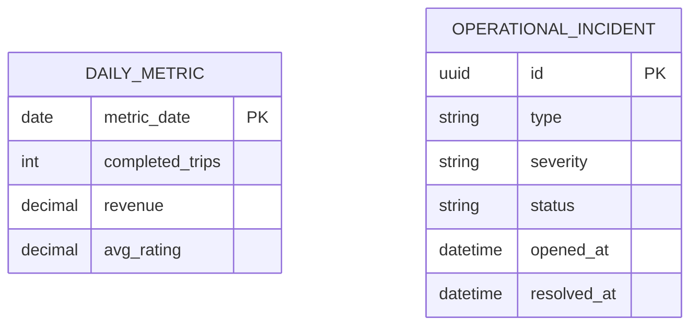

> Các bảng `*_projection` nhận dữ liệu từ event stream; chúng không phải transaction tables của BC03/04/05/06/07/09.

### 10. Database Type
**PostgreSQL read database**, có thể mở rộng sang **ClickHouse/OLAP** khi dữ liệu báo cáo rất lớn.

### 11. Giải thích lý do kỹ thuật
Reporting có workload đọc/aggregation khác Core Domain. Read model riêng giúp dashboard không ảnh hưởng transaction; OLAP chỉ thêm khi quy mô dữ liệu cần scan/aggregate lớn.

### 12. Domain Events
`OperationalCaseOpened`, `OperationalCaseResolved`, `ReportGenerated`.

**Events subscribed để dựng projection:** `RideRequestSubmitted`, `RideRequestCancelled`, `DriverBecameReady`, `DriverWentOffline`, `DriverPositionUpdated`, `DriverAssigned`, `TripCreated`, `TripStatusChanged`, `TripCompleted`, `FareCalculated`, `PaymentSucceeded`, `PaymentFailed`, `RatingSubmitted`.

---

# 4. Context Map và giao tiếp giữa Microservices

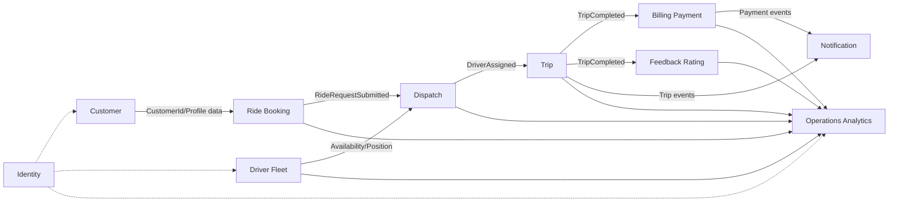

### Giao tiếp

| Nhu cầu | Cơ chế |
|---|---|
| Cần phản hồi ngay, ví dụ login/read detail | REST/gRPC API |
| Thông báo rằng nghiệp vụ đã xảy ra | Integration Event/message broker |
| Provider ngoài hệ thống | Adapter / Anti-Corruption Layer |
| Reporting | Consume events → Projection |

---

# 5. Database Ownership

| Microservice | DB owner | DB type |
|---|---|---|
| `identity-service` | `identity_db` | PostgreSQL (+ Redis optional) |
| `customer-service` | `customer_db` | PostgreSQL |
| `driver-fleet-service` | `driver_fleet_db` | PostgreSQL + Redis |
| `ride-booking-service` | `ride_booking_db` | PostgreSQL |
| `dispatch-service` | `dispatch_db` | PostgreSQL + Redis |
| `trip-service` | `trip_db` | PostgreSQL + Time-series optional |
| `billing-payment-service` | `billing_db` | PostgreSQL |
| `notification-service` | `notification_db` | PostgreSQL + Redis |
| `feedback-service` | `feedback_db` | PostgreSQL |
| `operations-analytics-service` | `operations_db` | PostgreSQL read DB + OLAP optional |

**Không có FK/transaction ACID xuyên database.** Cross-service reference chỉ dùng ID hoặc contract.

---

# 6. Domain Events chính toàn hệ thống

```text
UserRegistered
   ↓
RideRequestSubmitted
   ↓
DispatchJobCreated
   ↓
DriverOffered
   ↓
DriverAssigned
   ↓
TripCreated
   ↓
TripStatusChanged
   ↓
TripCompleted
   ├──→ FareCalculated
   │      ↓
   │   PaymentInitiated
   │      ↓
   │   PaymentSucceeded / PaymentFailed
   ├──→ ReviewEligibility
   │      ↓
   │   RatingSubmitted
   └──→ NotificationCreated
```

### Event ownership

| Event | Publisher |
|---|---|
| `UserRegistered` | Identity |
| `CustomerCreated` | Customer |
| `DriverBecameReady` | Driver & Fleet |
| `RideRequestSubmitted` | Ride Booking |
| `DriverAssigned` | Dispatch |
| `TripCompleted` | Trip |
| `FareCalculated` | Billing |
| `PaymentSucceeded` | Billing |
| `NotificationSent` | Notification |
| `RatingSubmitted` | Feedback |
| `ReportGenerated` | Operations |

---

# 7. Kỹ thuật triển khai Microservice

## 7.1. Database-per-Service
Mỗi service sở hữu DB riêng. Không query trực tiếp DB của service khác.

## 7.2. Transaction Boundary
Transaction ACID chỉ nằm trong một service. Không cố tạo distributed transaction giữa Booking → Dispatch → Trip → Payment.

## 7.3. Outbox Pattern
Khi một aggregate thay đổi:

```text
BEGIN TX
  Update domain tables
  Insert OutboxMessage
COMMIT
       ↓
Outbox Publisher
       ↓
Message Broker
       ↓
Consumer Services
```

Mục tiêu: không xảy ra trường hợp DB commit nhưng event bị mất.

## 7.4. Inbox / Idempotency
Consumer lưu `eventId/messageId` đã xử lý để event gửi lại không làm duplicate nghiệp vụ.

Đặc biệt bắt buộc cho:
- Payment callback.
- `RideRequestSubmitted` → Dispatch.
- `TripCompleted` → Billing.
- Notification retry.

## 7.5. API Gateway / BFF
Frontend không gọi trực tiếp toàn bộ internal service. Nên đi qua API Gateway/BFF để:
- Authentication.
- Rate limit.
- Routing.
- API versioning.
- Aggregate response cho UI.

---

# 8. Mapping FR → BC → Workflow → Microservice

| FR | Nội dung tổng quát | BC | Workflow | Service |
|---|---|---|---|---|
| FR01 | Account/Profile | BC01, BC02 | W01 | identity/customer |
| FR02 | Nhập điểm đón | BC04 | W02 | ride-booking |
| FR03 | Điểm đến | BC04 | W02 | ride-booking |
| FR04 | Chọn loại xe/dịch vụ | BC04 | W02 | ride-booking |
| FR05 | Tìm driver | BC03, BC05 | W03 | driver-fleet/dispatch |
| FR06 | Lọc driver phù hợp | BC03, BC05 | W03 | driver-fleet/dispatch |
| FR07 | Gửi lời mời | BC05 | W03 | dispatch |
| FR08 | Driver nhận/chấp nhận | BC05 | W03 | dispatch |
| FR09 | Không tìm thấy driver | BC05 + BC08 | W03, W06 | dispatch/notification |
| FR10 | Thực hiện chuyến | BC03, BC06 | W04 | driver-fleet/trip |
| FR11 | Theo dõi chuyến | BC06 | W04 | trip |
| FR12 | Tính cước | BC07 | W05 | billing-payment |
| FR13 | Thanh toán | BC07 | W05 | billing-payment |
| FR14 | Thông báo | BC08 | W02–W07 | notification |
| FR15 | Đánh giá | BC09 | W07 | feedback |
| FR16 | Quản lý/vận hành dữ liệu | BC02, BC03, BC10 | W08 | customer/driver/ops |
| FR17 | Báo cáo | BC10 | W08 | operations-analytics |
| FR18 | Authorization | BC01 + tất cả service | W01–W08 | identity + all |
| FR19 | Security/Audit | BC01 + tất cả service | W01–W08 | identity + all |

---

# 9. Lý do chia 10 BC

| BC | Lý do có Boundary riêng |
|---|---|
| Identity | Credential/authorization có security model riêng |
| Customer | Customer profile khác identity |
| Driver & Fleet | Driver/vehicle/availability có invariant riêng và là dữ liệu đầu vào của dispatch |
| Ride Booking | Core entry point, quản lý nhu cầu đặt xe trước khi có driver |
| Dispatch | Thuật toán chọn driver và assignment có model riêng |
| Trip | State machine chuyến xe là core invariant riêng |
| Billing | Monetary invariant, payment idempotency và audit riêng |
| Notification | Delivery/retry/provider không nên nằm trong Core Domain |
| Feedback | Eligibility và uniqueness của rating riêng |
| Operations | Read/reporting cần model đọc riêng, không coupling source data |

---

# 10. Lưu ý nghiệp vụ cần chốt lại trong SRS

- `FR01` nên tách rõ phần **Identity Account** và **Customer Profile** để tránh overlap.
- `FR16` cần xác định chính xác những màn hình/quyền quản trị nào thuộc Customer, Driver hay Operations.
- Phần truy xuất yêu cầu trong `srs.md` có đoạn nội dung chuyển sang nghiệp vụ **bảo dưỡng/sửa chữa xe**; phần này không nên trộn vào CAB Ride-Hailing Domain nếu đó không phải phạm vi chính thức.
- Cần chốt state machine chính thức của Trip và Driver trước khi code để tránh sử dụng một enum trạng thái chung cho nhiều BC.

---

# 11. Cấu trúc source code đề xuất cho mỗi Microservice

```text
<service-name>/
├── src/
│   ├── Domain/
│   │   ├── Aggregates/
│   │   ├── Entities/
│   │   ├── ValueObjects/
│   │   ├── Services/
│   │   ├── Events/
│   │   └── Repositories/
│   ├── Application/
│   │   ├── Commands/
│   │   ├── Queries/
│   │   ├── Handlers/
│   │   └── DTOs/
│   ├── Infrastructure/
│   │   ├── Persistence/
│   │   ├── Messaging/
│   │   ├── External/
│   │   └── Configuration/
│   └── Interfaces/
│       ├── REST/
│       └── Consumers/
└── tests/
    ├── Domain/
    ├── Application/
    └── Integration/
```

---

# 12. Checklist nghiệm thu thiết kế

- [x] Có 10 Bounded Context.
- [x] Mỗi BC có boundary và trách nhiệm riêng.
- [x] Mỗi BC có **Ubiquitous Language riêng**, tránh dùng lẫn thuật ngữ.
- [x] Mỗi BC có FR liên quan.
- [x] Mỗi BC gắn với Business Process Model/Workflow.
- [x] Mỗi BC có Aggregate và invariant.
- [x] Mỗi BC là một Microservice riêng.
- [x] Mỗi Microservice có API chính.
- [x] Mỗi Microservice có database riêng.
- [x] Có ERD cho từng database.
- [x] Có Database Type.
- [x] Có giải thích lý do kỹ thuật chọn database.
- [x] Có Domain Events và Event ownership.
- [x] Có Context Map.
- [x] Có Database-per-Service.
- [x] Có Outbox/Inbox/Idempotency.
- [x] Có mapping FR → BC → Workflow → Microservice.

---

# 13. Kết luận

Thiết kế đề xuất biến CAB System thành kiến trúc DDD với ranh giới rõ ràng giữa **Identity, Customer, Driver/Fleet, Booking, Dispatch, Trip, Billing, Notification, Feedback và Operations**. Core flow tập trung ở **Ride Booking → Dispatch → Trip Execution**, còn Billing, Feedback, Notification và Operations nhận dữ liệu qua API/Event theo đúng boundary.

Mỗi BC giữ **Ubiquitous Language, Aggregate, Database và Domain Events riêng**, giúp hệ thống có thể triển khai độc lập thành microservice nhưng vẫn giữ được tính nhất quán của mô hình nghiệp vụ.
