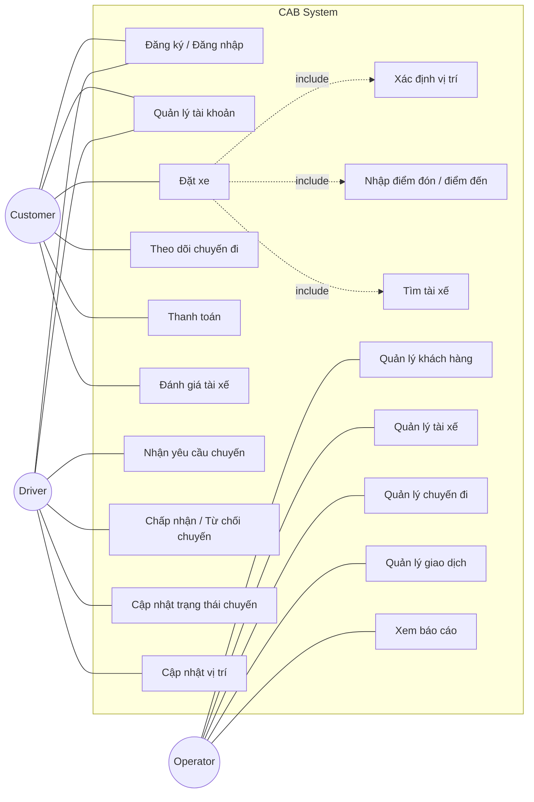

Bước 1: Xác định Business contact và Business problem: Khách hàng cần quan tâm những gì, vì sao hệ thống không đủ đáp ứng, ai dùng, hệ thống mới cần đáp ứng những gì.
1. Business Contact – Khách hàng cần quan tâm những gì?

Khách hàng đang quan tâm đến:
Đặt xe: Khách hàng có thể đặt xe nhanh chóng, nhập điểm đón và điểm đến.
Tìm tài xế: Hệ thống tự động tìm và phân công tài xế phù hợp, ưu tiên tài xế gần khách.
Theo dõi chuyến: Biết tài xế nào nhận chuyến, vị trí và trạng thái chuyến.
Tính cước & thanh toán: Tính tiền chính xác, hỗ trợ tiền mặt và thanh toán điện tử.
Thông báo: Thông báo kịp thời cho khách hàng và tài xế.
Quản lý người dùng: Quản lý khách hàng, tài xế, phương tiện.
Báo cáo: Theo dõi số chuyến, doanh thu, tỷ lệ hoàn thành, hủy chuyến và hiệu quả tài xế.
Bảo mật: Bảo vệ thông tin cá nhân, vị trí và dữ liệu giao dịch.
Khả năng mở rộng: Có thể thêm dịch vụ, phương thức thanh toán và kênh thông báo mới.

2. Business Problem – Vì sao hệ thống hiện tại không đủ đáp ứng?
Hệ thống hiện tại có các vấn đề:
Phân công tài xế chủ yếu thủ công → mất thời gian, khó tối ưu.
Khách hàng khó theo dõi trạng thái chuyến đi.
Thông tin thanh toán chưa được quản lý tập trung.
Khó xử lý khi tài xế từ chối hoặc không phản hồi.
Bộ phận vận hành khó theo dõi và xử lý chuyến lỗi.
Khó mở rộng khi số lượng khách hàng và tài xế tăng.
Hệ thống chưa đủ linh hoạt để thêm tính năng mới trong tương lai.
Chưa đáp ứng tốt yêu cầu về bảo mật, phân quyền và lưu vết.

3. Ai sử dụng hệ thống?
Có 3 nhóm người dùng chính:
Người dùng	Mục đích chính
Khách hàng	Đặt xe, theo dõi chuyến, thanh toán, đánh giá
Tài xế	Nhận chuyến, thực hiện chuyến, cập nhật trạng thái/vị trí
Nhân viên vận hành	Quản lý người dùng, tài xế, chuyến đi, giao dịch và báo cáo
Ngoài ra có hệ thống bên ngoài:
Nhà cung cấp thanh toán.
Nhà cung cấp dịch vụ thông báo.

4. Hệ thống mới cần đáp ứng những gì?
Hệ thống CAB mới cần tự động hóa toàn bộ quy trình từ đặt xe → tìm tài xế → thực hiện chuyến → tính cước → thanh toán → thông báo → đánh giá; đồng thời đảm bảo bảo mật, khả năng mở rộng, phân quyền và hoạt động ổn định khi số lượng người dùng tăng cao.

Stakeholder của CAB System
| STT | Stakeholder                 | Vai trò                                 | Mối quan tâm chính                                    |
| --: | --------------------------- | --------------------------------------- | ----------------------------------------------------- |
|   1 | **Ban giám đốc**            | Đưa ra định hướng, phê duyệt dự án      | Doanh thu, hiệu quả, khả năng mở rộng                 |
|   2 | **Khách hàng**              | Sử dụng dịch vụ đặt xe                  | Đặt xe nhanh, tìm tài xế, theo dõi chuyến, thanh toán |
|   3 | **Tài xế**                  | Nhận và thực hiện chuyến xe             | Nhận chuyến, cập nhật trạng thái, quản lý phương tiện |
|   4 | **Nhân viên vận hành**      | Quản lý và hỗ trợ hoạt động             | Quản lý khách hàng, tài xế, chuyến đi, xử lý sự cố    |
|   5 | **Nhà cung cấp thanh toán** | Xử lý thanh toán điện tử                | Giao dịch chính xác, an toàn                          |
|   6 | **Nhà cung cấp thông báo**  | Cung cấp dịch vụ gửi thông báo          | Gửi thông báo ổn định, đúng thời điểm                 |
|   7 | **Đội phát triển hệ thống** | Phân tích, xây dựng và bảo trì hệ thống | Yêu cầu rõ ràng, hệ thống dễ mở rộng                  |
|   8 | **Bộ phận IT/Bảo mật**      | Đảm bảo hạ tầng và bảo mật              | Bảo mật dữ liệu, phân quyền, ổn định hệ thống         |

Ma trận Stakeholder Matrix
| **Quyền lực ↓ / Quan tâm →** |                       **Thấp**                      |                             **Cao**                            |
| :--------------------------- | :-------------------------------------------------: | :------------------------------------------------------------: |
| **Cao**                      |          **GIỮ HÀI LÒNG** • IT / Bảo mật         | **QUẢN LÝ CHẶT CHẼ** • Ban giám đốc • Nhân viên vận hành |
| **Thấp**                     | **THEO DÕI** • NCC thông báo • NCC thanh toán |     **GIỮ HÀI LÒNG / TRAO ĐỔI** • Khách hàng • Tài xế    |
| **Trung bình**               |           **THEO DÕI** • NCC thanh toán          |                **PHỐI HỢP** • Đội phát triển                |

Bước 3: Xác định Business Goals
| Business Goal ID | Business Goal                       | Mục tiêu                                                                                   |
| ---------------- | ----------------------------------- | ------------------------------------------------------------------------------------------ |
| **BG01**        | **Tự động hóa đặt xe**              | Tự động tìm và phân công tài xế, giảm thao tác thủ công.                                   |
| **BG02**        | **Nâng cao trải nghiệm khách hàng** | Đặt xe nhanh, theo dõi trạng thái chuyến và thanh toán thuận tiện.                         |
| **BG03**        | **Nâng cao hiệu quả vận hành**      | Giúp nhân viên quản lý khách hàng, tài xế, chuyến đi và xử lý sự cố.                       |
| **BG04**        | **Tăng khả năng mở rộng**           | Phục vụ số lượng lớn khách hàng, tài xế và chuyến đi.                                      |
| **BG05**        | **Quản lý doanh thu hiệu quả**      | Tính cước chính xác và quản lý tập trung giao dịch, doanh thu.                             |
| **BG06**        | **Đảm bảo an toàn và bảo mật**      | Bảo vệ thông tin cá nhân, vị trí và dữ liệu giao dịch.                                     |
| **BG07**        | **Hỗ trợ ra quyết định**            | Cung cấp báo cáo về doanh thu, số chuyến, tỷ lệ hoàn thành, hủy chuyến và hiệu quả tài xế. |
| **BG08**        | **Phát triển nền tảng lâu dài**     | Dễ dàng bổ sung dịch vụ, phương thức thanh toán và kênh thông báo mới.                     |

Bước 4: Xác định Scope(Phạm Vi)
| Scope ID      | Phạm vi                    | Nội dung                                          |
| ------------- | -------------------------- | ------------------------------------------------- |
| **Scope 01** | **Quản lý tài khoản**      | Đăng ký, đăng nhập và cập nhật thông tin.         |
| **Scope 02** | **Đặt xe**                 | Nhập điểm đón, điểm đến và chọn loại xe.          |
| **Scope 03** | **Tìm tài xế**             | Tự động tìm và phân công tài xế phù hợp.          |
| **Scope 04** | **Quản lý chuyến đi**      | Theo dõi và cập nhật trạng thái chuyến xe.        |
| **Scope 05** | **Tính cước & thanh toán** | Tính tiền và hỗ trợ thanh toán.                   |
| **Scope 06** | **Thông báo**              | Gửi thông báo về chuyến đi và thanh toán.         |
| **Scope 07** | **Đánh giá**               | Khách hàng đánh giá tài xế sau chuyến đi.         |
| **Scope 08** | **Quản trị**               | Quản lý khách hàng, tài xế, chuyến đi và báo cáo. |
| **Scope 09** | **Bảo mật & phân quyền**   | Xác thực và phân quyền người dùng.                |

Bước 5: Business requirement
| BR ID    | Business Requirement        | Mô tả                                                                                 |
| -------- | --------------------------- | ------------------------------------------------------------------------------------- |
| **BR01** | **Tự động hóa đặt xe**      | Hệ thống phải hỗ trợ khách hàng đặt xe và tự động tìm tài xế phù hợp.                 |
| **BR02** | **Quản lý chuyến đi**       | Hệ thống phải quản lý toàn bộ quá trình từ đặt xe đến hoàn thành chuyến.              |
| **BR03** | **Quản lý tài xế**          | Hệ thống phải quản lý thông tin, trạng thái và phương tiện của tài xế.                |
| **BR04** | **Thanh toán và tính cước** | Hệ thống phải tính cước và hỗ trợ thanh toán tiền mặt hoặc điện tử.                   |
| **BR05** | **Thông báo**               | Hệ thống phải thông báo kịp thời cho khách hàng và tài xế về trạng thái chuyến.       |
| **BR06** | **Quản lý vận hành**        | Hệ thống phải hỗ trợ nhân viên quản lý khách hàng, tài xế, chuyến đi và giao dịch.    |
| **BR07** | **Báo cáo**                 | Hệ thống phải cung cấp báo cáo về chuyến đi, doanh thu và hiệu quả hoạt động.         |
| **BR08** | **Bảo mật và phân quyền**   | Hệ thống phải xác thực người dùng, phân quyền và bảo vệ dữ liệu.                      |
| **BR09** | **Khả năng mở rộng**        | Hệ thống phải có khả năng mở rộng khi số lượng người dùng và chuyến đi tăng.          |
| **BR10** | **Khả năng phát triển**     | Hệ thống phải cho phép bổ sung dịch vụ, phương thức thanh toán và kênh thông báo mới. |

Bước 6: Business Process
| Bước     | Business Process           | Mô tả                                                    |
| -------- | -------------------------- | -------------------------------------------------------- |
| **BP01** | **Đăng nhập**              | Khách hàng đăng nhập vào hệ thống.                       |
| **BP02** | **Xác định vị trí**        | Hệ thống xác định vị trí khách hàng.                     |
| **BP03** | **Nhập thông tin chuyến**  | Khách hàng nhập điểm đón và điểm đến.                    |
| **BP04** | **Tìm tài xế**             | Hệ thống tìm tài xế sẵn có và phù hợp.                   |
| **BP05** | **Phân công tài xế**       | Hệ thống gửi yêu cầu cho tài xế phù hợp.                 |
| **BP06** | **Xác nhận chuyến**        | Tài xế nhận chuyến và hệ thống thông báo cho khách hàng. |
| **BP07** | **Thực hiện chuyến**       | Tài xế đến đón khách và di chuyển đến điểm đến.          |
| **BP08** | **Theo dõi chuyến**        | Khách hàng theo dõi vị trí và trạng thái chuyến.         |
| **BP09** | **Hoàn thành chuyến**      | Tài xế xác nhận hoàn thành chuyến.                       |
| **BP10** | **Tính cước & thanh toán** | Hệ thống tính cước và xử lý thanh toán.                  |
| **BP11** | **Đánh giá**               | Khách hàng đánh giá tài xế.                              |
Luồng phụ
| Mã         | Trường hợp                    | Xử lý                                      |
| ---------- | ----------------------------- | ------------------------------------------ |
| **BP-P01** | Không tìm thấy tài xế         | Thông báo cho khách hàng.                  |
| **BP-P02** | Tài xế từ chối/không phản hồi | Hệ thống tìm tài xế khác.                  |
| **BP-P03** | Thanh toán thất bại           | Thông báo lỗi và xử lý thanh toán lại.     |
| **BP-P04** | Khách hàng hủy chuyến         | Hệ thống xử lý theo chính sách hủy chuyến. |

Bước 7: Phân rã yêu cầu về chức năng 
| FR ID    | Chức năng                      | Mô tả                                                   |
| -------- | ------------------------------ | ------------------------------------------------------- |
| **FR01** | **Quản lý tài khoản**          | Đăng ký, đăng nhập, cập nhật thông tin.                 |
| **FR02** | **Xác định vị trí khách hàng** | Xác định vị trí hiện tại của khách hàng.                |
| **FR03** | **Xác định điểm đón**          | Nhập hoặc chọn điểm đón.                                |
| **FR04** | **Xác định điểm đến**          | Nhập hoặc chọn điểm đến.                                |
| **FR05** | **Tìm tài xế sẵn có**          | Tìm các tài xế đang sẵn sàng nhận chuyến.               |
| **FR06** | **Lọc theo loại xe**           | Lọc tài xế phù hợp với loại xe.                         |
| **FR07** | **Tính khoảng cách**           | Tính khoảng cách giữa khách hàng và tài xế.             |
| **FR08** | **Phân công tài xế**           | Gửi yêu cầu chuyến cho tài xế phù hợp.                  |
| **FR09** | **Xử lý từ chối**              | Tìm tài xế khác khi tài xế từ chối hoặc không phản hồi. |
| **FR10** | **Theo dõi chuyến đi**         | Theo dõi vị trí và trạng thái chuyến xe.                |
| **FR11** | **Cập nhật trạng thái chuyến** | Cập nhật trạng thái chuyến xe.                          |
| **FR12** | **Tính cước**                  | Tính số tiền khách hàng phải trả.                       |
| **FR13** | **Thanh toán**                 | Hỗ trợ thanh toán tiền mặt và điện tử.                  |
| **FR14** | **Thông báo**                  | Gửi thông báo về chuyến đi và thanh toán.               |
| **FR15** | **Đánh giá tài xế**            | Khách hàng đánh giá tài xế sau chuyến đi.               |
| **FR16** | **Quản lý vận hành**           | Quản lý khách hàng, tài xế, phương tiện và chuyến đi.   |
| **FR17** | **Báo cáo**                    | Xem báo cáo về chuyến đi, doanh thu và hoạt động.       |
| **FR18** | **Phân quyền**                 | Phân quyền cho các nhóm người dùng.                     |
| **FR19** | **Bảo mật**                    | Xác thực và bảo vệ thông tin người dùng.                |

Bước 8: Business Rules & Acceptance Criteria
| ID       | Business Rule                                                 | Acceptance Criteria                                                                                           |
| -------- | ------------------------------------------------------------- | ------------------------------------------------------------------------------------------------------------- |
| **BR01** | Người dùng phải đăng nhập trước khi sử dụng chức năng đặt xe. | Đăng nhập thành công → được phép đặt xe; chưa đăng nhập → không được đặt xe.                                  |
| **BR02** | Chỉ tài xế đang sẵn sàng mới được nhận chuyến.                | Tài xế sẵn sàng → nhận được yêu cầu; không sẵn sàng → không nhận được chuyến.                                 |
| **BR03** | Hệ thống ưu tiên tài xế phù hợp và gần khách hàng.            | Hệ thống tìm và đề xuất tài xế phù hợp theo tiêu chí đã xác định.                                             |
| **BR04** | Tài xế từ chối hoặc không phản hồi → tìm tài xế khác.         | Hệ thống tự động chuyển yêu cầu sang tài xế tiếp theo.                                                        |
| **BR05** | Không tìm được tài xế → thông báo khách hàng.                 | Khách hàng nhận được thông báo không tìm thấy tài xế.                                                         |
| **BR06** | Chuyến đi phải cập nhật đúng trạng thái.                      | Trạng thái được cập nhật theo trình tự: nhận chuyến → đến điểm đón → đón khách → đang di chuyển → hoàn thành. |
| **BR07** | Hệ thống phải tính đúng cước chuyến đi.                       | Sau khi hoàn thành chuyến, hệ thống hiển thị số tiền khách hàng phải trả.                                     |
| **BR08** | Hỗ trợ thanh toán tiền mặt và điện tử.                        | Khách hàng chọn được phương thức thanh toán; thanh toán thành công → ghi nhận giao dịch.                      |
| **BR09** | Chỉ chuyến đã hoàn thành mới được đánh giá.                   | Chuyến hoàn thành → cho phép đánh giá; chuyến chưa hoàn thành → không cho đánh giá.                           |
| **BR10** | Nhân viên chỉ được thực hiện chức năng theo quyền.            | Người không có quyền → hệ thống từ chối thao tác.                                                             |
| **BR11** | Thông tin người dùng phải được bảo vệ.                        | Người không có quyền không thể truy cập dữ liệu được bảo vệ.                                                  |

Bước 9: Data model
| Bảng             | Một số thuộc tính chính                                                   | Quan hệ                         |
| ---------------- | ------------------------------------------------------------------------- | ------------------------------- |
| **Customer**     | CustomerID, Name, Phone, Email                                            | Đặt nhiều chuyến                |
| **Driver**       | DriverID, Name, Phone, Status, Location                                   | Nhận nhiều chuyến               |
| **Vehicle**      | VehicleID, DriverID, Type, LicensePlate                                   | Tài xế sở hữu/sử dụng           |
| **Trip**         | TripID, CustomerID, DriverID, Pickup, Destination, Status, Distance, Fare | Liên kết khách hàng và tài xế   |
| **Payment**      | PaymentID, TripID, Amount, Method, Status                                 | Gắn với chuyến đi               |
| **Rating**       | RatingID, TripID, CustomerID, DriverID, Score, Comment                    | Đánh giá sau chuyến             |
| **Notification** | NotificationID, UserID, Content, Type, Status                             | Gửi thông báo cho người dùng    |
| **User**         | UserID, Username, Password, Role                                          | Quản lý đăng nhập và phân quyền |

Bước 10: Yêu cầu không phải chức năng
| NFR ID    | Non-Functional Requirement | Mô tả                                                                  |
| --------- | -------------------------- | ---------------------------------------------------------------------- |
| **NFR01** | **Performance**            | Hệ thống phải phản hồi nhanh khi khách hàng đặt xe.                    |
| **NFR02** | **Scalability**            | Hệ thống có khả năng phục vụ số lượng lớn khách hàng và tài xế.        |
| **NFR03** | **Security**               | Bảo vệ thông tin cá nhân, vị trí và dữ liệu giao dịch.                 |
| **NFR04** | **Availability**           | Hệ thống hoạt động ổn định, hạn chế gián đoạn dịch vụ.                 |
| **NFR05** | **Reliability**            | Lỗi ở một chức năng không được làm ảnh hưởng toàn bộ hệ thống.         |
| **NFR06** | **Maintainability**        | Dễ bảo trì và cập nhật các chức năng mới.                              |
| **NFR07** | **Usability**              | Giao diện dễ sử dụng đối với khách hàng, tài xế và nhân viên.          |
| **NFR08** | **Extensibility**          | Có thể mở rộng thêm dịch vụ, phương thức thanh toán và kênh thông báo. |
| **NFR09** | **Auditability**           | Lưu lại các thao tác quan trọng để kiểm tra khi xảy ra sự cố.          |

Bước 11: Vẽ các UseCase

Bước 12: Đặc Tả UseCase
| Thành phần         | Nội dung                                                                                                                    |
| ------------------ | --------------------------------------------------------------------------------------------------------------------------- |
| **Use Case ID**    | UC01                                                                                                                        |
| **Tên**            | Đặt xe                                                                                                                      |
| **Actor**          | Customer                                                                                                                    |
| **Mục tiêu**       | Khách hàng tạo yêu cầu đặt xe.                                                                                              |
| **Tiền điều kiện** | Khách hàng đã đăng nhập.                                                                                                    |
| **Luồng chính**    | 1. Nhập điểm đón → 2. Nhập điểm đến → 3. Gửi yêu cầu → 4. Hệ thống tìm tài xế → 5. Tài xế nhận chuyến → 6. Xác nhận đặt xe. |
| **Luồng phụ**      | Không tìm được tài xế → thông báo khách hàng. Tài xế từ chối/không phản hồi → tìm tài xế khác.                              |
| **Hậu điều kiện**  | Chuyến xe được tạo và gán cho tài xế.                                                                                       |

| Thành phần         | Nội dung                                                                                                        |
| ------------------ | --------------------------------------------------------------------------------------------------------------- |
| **Use Case ID**    | UC02                                                                                                            |
| **Tên**            | Tìm tài xế                                                                                                      |
| **Actor**          | System                                                                                                          |
| **Mục tiêu**       | Tìm tài xế phù hợp cho chuyến đi.                                                                               |
| **Tiền điều kiện** | Có yêu cầu đặt xe.                                                                                              |
| **Luồng chính**    | 1. Xác định vị trí khách → 2. Tìm tài xế sẵn có → 3. Lọc tài xế → 4. Tính khoảng cách → 5. Chọn tài xế phù hợp. |
| **Luồng phụ**      | Tài xế từ chối/không phản hồi → tìm tài xế khác. Không còn tài xế → thông báo khách hàng.                       |
| **Hậu điều kiện**  | Tìm được tài xế hoặc thông báo không tìm được.                                                                  |

| Thành phần         | Nội dung                                                                                                    |
| ------------------ | ----------------------------------------------------------------------------------------------------------- |
| **Use Case ID**    | UC03                                                                                                        |
| **Tên**            | Theo dõi chuyến đi                                                                                          |
| **Actor**          | Customer                                                                                                    |
| **Mục tiêu**       | Khách hàng theo dõi trạng thái và vị trí tài xế.                                                            |
| **Tiền điều kiện** | Chuyến xe đã được tài xế nhận.                                                                              |
| **Luồng chính**    | 1. Mở chuyến → 2. Xem vị trí tài xế → 3. Xem trạng thái chuyến → 4. Cập nhật liên tục khi tài xế di chuyển. |
| **Hậu điều kiện**  | Khách hàng biết được trạng thái hiện tại của chuyến.                                                        |

| Thành phần         | Nội dung                                                                                           |
| ------------------ | -------------------------------------------------------------------------------------------------- |
| **Use Case ID**    | UC04                                                                                               |
| **Tên**            | Thanh toán                                                                                         |
| **Actor**          | Customer                                                                                           |
| **Mục tiêu**       | Khách hàng thanh toán tiền chuyến xe.                                                              |
| **Tiền điều kiện** | Chuyến xe đã hoàn thành và có số tiền cần thanh toán.                                              |
| **Luồng chính**    | 1. Hệ thống tính cước → 2. Khách chọn phương thức → 3. Thực hiện thanh toán → 4. Ghi nhận kết quả. |
| **Luồng phụ**      | Thanh toán điện tử thất bại → thông báo và cho phép thanh toán lại.                                |
| **Hậu điều kiện**  | Giao dịch được ghi nhận thành công.                                                                |

| Thành phần         | Nội dung                                                                                  |
| ------------------ | ----------------------------------------------------------------------------------------- |
| **Use Case ID**    | UC05                                                                                      |
| **Tên**            | Đánh giá tài xế                                                                           |
| **Actor**          | Customer                                                                                  |
| **Mục tiêu**       | Khách hàng đánh giá chất lượng chuyến đi.                                                 |
| **Tiền điều kiện** | Chuyến xe đã hoàn thành.                                                                  |
| **Luồng chính**    | 1. Chọn chuyến đã hoàn thành → 2. Chọn mức đánh giá → 3. Nhập nhận xét → 4. Gửi đánh giá. |
| **Hậu điều kiện**  | Đánh giá được lưu vào hệ thống.                                                           |

| Thành phần | Nội dung |
|------------|----------|
| **Use Case ID** | UC06 |
| **Tên** | Quản lý tài khoản khách hàng |
| **Actor** | Customer |
| **Mục tiêu** | Khách hàng đăng ký, đăng nhập và cập nhật thông tin tài khoản. |
| **Tiền điều kiện** | Người dùng chưa đăng nhập khi đăng ký/đăng nhập; đã đăng nhập khi cập nhật thông tin. |
| **Luồng chính** | 1. Khách hàng chọn đăng ký/đăng nhập → 2. Nhập thông tin tài khoản → 3. Hệ thống kiểm tra thông tin → 4. Khách hàng truy cập hồ sơ → 5. Cập nhật thông tin → 6. Hệ thống lưu thông tin. |
| **Hậu điều kiện** | Tài khoản được tạo hoặc thông tin cá nhân được cập nhật. |

| Thành phần | Nội dung |
|------------|----------|
| **Use Case ID** | UC07 |
| **Tên** | Quản lý hồ sơ tài xế |
| **Actor** | Driver, Nhân viên vận hành |
| **Mục tiêu** | Tài xế đăng ký hoặc được nhân viên vận hành tạo tài khoản và cập nhật thông tin hồ sơ. |
| **Tiền điều kiện** | Tài xế chưa có tài khoản khi đăng ký; tài khoản đã tồn tại khi cập nhật thông tin. |
| **Luồng chính** | 1. Tài xế đăng ký hoặc nhân viên vận hành tạo tài khoản → 2. Đăng nhập → 3. Truy cập hồ sơ → 4. Nhập/cập nhật thông tin → 5. Hệ thống kiểm tra → 6. Lưu thông tin. |
| **Hậu điều kiện** | Hồ sơ tài xế được tạo hoặc cập nhật trong hệ thống. |

| Thành phần | Nội dung |
|------------|----------|
| **Use Case ID** | UC08 |
| **Tên** | Quản lý phương tiện |
| **Actor** | Driver, Nhân viên vận hành |
| **Mục tiêu** | Quản lý và cập nhật thông tin phương tiện của tài xế. |
| **Tiền điều kiện** | Tài xế đã có tài khoản hoặc nhân viên vận hành có quyền quản lý. |
| **Luồng chính** | 1. Truy cập thông tin phương tiện → 2. Nhập/cập nhật thông tin → 3. Gửi thông tin → 4. Hệ thống kiểm tra → 5. Lưu thông tin phương tiện. |
| **Hậu điều kiện** | Thông tin phương tiện được lưu hoặc cập nhật trong hệ thống. |

| Thành phần | Nội dung |
|------------|----------|
| **Use Case ID** | UC09 |
| **Tên** | Cập nhật trạng thái tài xế |
| **Actor** | Driver |
| **Mục tiêu** | Tài xế cập nhật trạng thái hoạt động để có thể nhận yêu cầu chuyến đi. |
| **Tiền điều kiện** | Tài xế đã đăng nhập và tài khoản hợp lệ. |
| **Luồng chính** | 1. Tài xế truy cập trạng thái hoạt động → 2. Chọn trạng thái sẵn sàng → 3. Hệ thống cập nhật trạng thái → 4. Tài xế có thể nhận yêu cầu chuyến phù hợp. |
| **Hậu điều kiện** | Trạng thái hoạt động của tài xế được cập nhật trong hệ thống. |

| Thành phần | Nội dung |
|------------|----------|
| **Use Case ID** | UC10 |
| **Tên** | Nhận và xử lý yêu cầu chuyến |
| **Actor** | Driver |
| **Mục tiêu** | Tài xế nhận thông báo yêu cầu chuyến phù hợp và chấp nhận hoặc từ chối chuyến. |
| **Tiền điều kiện** | Tài xế đang ở trạng thái sẵn sàng và có yêu cầu chuyến phù hợp. |
| **Luồng chính** | 1. Hệ thống gửi thông báo yêu cầu chuyến → 2. Tài xế xem thông tin chuyến → 3. Tài xế chấp nhận chuyến → 4. Hệ thống ghi nhận tài xế được phân công → 5. Hệ thống thông báo cho khách hàng. |
| **Hậu điều kiện** | Chuyến đi được phân công cho tài xế hoặc hệ thống tiếp tục tìm tài xế khác. |

| Thành phần | Nội dung |
|------------|----------|
| **Use Case ID** | UC11 |
| **Tên** | Cập nhật trạng thái chuyến |
| **Actor** | Driver |
| **Mục tiêu** | Tài xế cập nhật trạng thái hiện tại của chuyến đi. |
| **Tiền điều kiện** | Tài xế đã chấp nhận chuyến đi. |
| **Luồng chính** | 1. Tài xế đến điểm đón → 2. Cập nhật trạng thái đã đến → 3. Đón khách → 4. Cập nhật trạng thái đang di chuyển → 5. Hoàn thành chuyến → 6. Hệ thống lưu trạng thái chuyến. |
| **Hậu điều kiện** | Trạng thái hiện tại của chuyến đi được cập nhật trong hệ thống. |

| Thành phần | Nội dung |
|------------|----------|
| **Use Case ID** | UC12 |
| **Tên** | Cập nhật vị trí tài xế |
| **Actor** | Driver, System |
| **Mục tiêu** | Cập nhật vị trí tài xế để hỗ trợ tìm tài xế gần và theo dõi chuyến đi. |
| **Tiền điều kiện** | Tài xế đang hoạt động và hệ thống có thể nhận thông tin vị trí. |
| **Luồng chính** | 1. Xác định vị trí tài xế → 2. Tài xế gửi thông tin vị trí → 3. Hệ thống nhận thông tin → 4. Lưu/cập nhật vị trí → 5. Sử dụng vị trí cho việc tìm tài xế và theo dõi chuyến đi. |
| **Hậu điều kiện** | Vị trí hiện tại của tài xế được cập nhật trong hệ thống. |

| Thành phần | Nội dung |
|------------|----------|
| **Use Case ID** | UC13 |
| **Tên** | Quản lý thông báo |
| **Actor** | System, Customer, Driver |
| **Mục tiêu** | Hệ thống gửi thông báo đến khách hàng và tài xế khi xảy ra các sự kiện liên quan đến chuyến đi. |
| **Tiền điều kiện** | Có sự kiện cần gửi thông báo cho khách hàng hoặc tài xế. |
| **Luồng chính** | 1. Sự kiện xảy ra → 2. Hệ thống xác định người nhận → 3. Tạo thông báo → 4. Gửi thông báo → 5. Khách hàng hoặc tài xế nhận thông báo. |
| **Hậu điều kiện** | Thông báo được gửi đến người nhận tương ứng. |

| Thành phần | Nội dung |
|------------|----------|
| **Use Case ID** | UC14 |
| **Tên** | Quản lý khách hàng |
| **Actor** | Nhân viên vận hành |
| **Mục tiêu** | Nhân viên vận hành quản lý và tra cứu thông tin khách hàng. |
| **Tiền điều kiện** | Nhân viên vận hành đã đăng nhập và có quyền quản lý khách hàng. |
| **Luồng chính** | 1. Truy cập chức năng quản lý khách hàng → 2. Tìm kiếm khách hàng → 3. Xem thông tin → 4. Thực hiện quản lý/cập nhật thông tin → 5. Hệ thống lưu thay đổi. |
| **Hậu điều kiện** | Thông tin khách hàng được tra cứu hoặc cập nhật theo quyền hạn. |

| Thành phần | Nội dung |
|------------|----------|
| **Use Case ID** | UC15 |
| **Tên** | Quản lý tài xế và chuyến đi |
| **Actor** | Nhân viên vận hành |
| **Mục tiêu** | Nhân viên vận hành theo dõi tài xế, chuyến đi và xử lý các vấn đề phát sinh trong chuyến. |
| **Tiền điều kiện** | Nhân viên vận hành đã đăng nhập và có quyền quản lý. |
| **Luồng chính** | 1. Truy cập chức năng quản lý → 2. Xem danh sách tài xế và chuyến đi → 3. Kiểm tra trạng thái → 4. Phát hiện và xử lý lỗi chuyến đi → 5. Cập nhật kết quả xử lý. |
| **Hậu điều kiện** | Thông tin tài xế/chuyến đi được theo dõi hoặc lỗi chuyến đi được xử lý. |

| Thành phần | Nội dung |
|------------|----------|
| **Use Case ID** | UC16 |
| **Tên** | Tra cứu lịch sử giao dịch |
| **Actor** | Nhân viên vận hành |
| **Mục tiêu** | Nhân viên vận hành tra cứu lịch sử các giao dịch thanh toán. |
| **Tiền điều kiện** | Nhân viên vận hành đã đăng nhập và có quyền tra cứu giao dịch. |
| **Luồng chính** | 1. Truy cập lịch sử giao dịch → 2. Nhập tiêu chí tìm kiếm → 3. Hệ thống tìm kiếm giao dịch → 4. Hiển thị kết quả → 5. Nhân viên vận hành xem thông tin giao dịch. |
| **Hậu điều kiện** | Lịch sử giao dịch được hiển thị theo tiêu chí tìm kiếm. |

| Thành phần | Nội dung |
|------------|----------|
| **Use Case ID** | UC17 |
| **Tên** | Xem báo cáo vận hành |
| **Actor** | Nhân viên vận hành, Ban lãnh đạo |
| **Mục tiêu** | Theo dõi số lượng chuyến đi, doanh thu, tỷ lệ hoàn thành/hủy chuyến và hiệu suất tài xế. |
| **Tiền điều kiện** | Người dùng đã đăng nhập và có quyền xem báo cáo. |
| **Luồng chính** | 1. Truy cập chức năng báo cáo → 2. Chọn loại báo cáo và khoảng thời gian → 3. Hệ thống tổng hợp dữ liệu → 4. Hiển thị báo cáo → 5. Người dùng xem kết quả. |
| **Hậu điều kiện** | Báo cáo vận hành được hiển thị cho người dùng. |

Bước 13: Tiêu chí chấp nhập (AC)
| AC ID    | Chức năng              | Tiêu chí chấp nhận                                                            |
| -------- | ---------------------- | ----------------------------------------------------------------------------- |
| **AC01** | **Đăng nhập**          | Đăng nhập đúng thông tin → vào được hệ thống.                                 |
| **AC02** | **Đặt xe**             | Nhập điểm đón, điểm đến → gửi được yêu cầu đặt xe.                            |
| **AC03** | **Tìm tài xế**         | Hệ thống tìm được tài xế phù hợp hoặc thông báo không tìm thấy.               |
| **AC04** | **Phân công tài xế**   | Tài xế nhận chuyến → hệ thống xác nhận chuyến cho khách hàng.                 |
| **AC05** | **Theo dõi chuyến đi** | Khách hàng xem được vị trí và trạng thái chuyến.                              |
| **AC06** | **Cập nhật chuyến**    | Tài xế cập nhật trạng thái → khách hàng nhận được trạng thái mới.             |
| **AC07** | **Tính cước**          | Chuyến hoàn thành → hệ thống hiển thị đúng số tiền cần thanh toán.            |
| **AC08** | **Thanh toán**         | Thanh toán thành công → hệ thống ghi nhận giao dịch.                          |
| **AC09** | **Thông báo**          | Khi có sự kiện quan trọng → khách hàng/tài xế nhận được thông báo.            |
| **AC10** | **Đánh giá**           | Chuyến hoàn thành → khách hàng có thể đánh giá tài xế.                        |
| **AC11** | **Quản trị**           | Nhân viên có quyền → thực hiện được chức năng quản trị tương ứng.             |
| **AC12** | **Bảo mật**            | Người không có quyền → không thể truy cập chức năng hoặc dữ liệu bị giới hạn. |

Bước 14: Truy xuất nguồn gốc yêu cầu
| Mã yêu cầu | Yêu cầu                                   | Business Process     | Use Case                      | Acceptance Criteria |
| ---------- | ----------------------------------------- | -------------------- | ----------------------------- | ------------------- |
| FR-01      | Đăng nhập hệ thống                        | Đăng nhập & xác thực | UC-01 Đăng nhập               | AC-01               |
| FR-02      | Quản lý thông tin khách hàng              | Quản lý khách hàng   | UC-02 Quản lý khách hàng      | AC-02               |
| FR-03      | Quản lý thông tin xe                      | Quản lý xe           | UC-03 Quản lý xe              | AC-03               |
| FR-04      | Tiếp nhận yêu cầu dịch vụ                 | Tiếp nhận yêu cầu    | UC-04 Tiếp nhận yêu cầu       | AC-04               |
| FR-05      | Tạo và quản lý yêu cầu bảo dưỡng/sửa chữa | Xử lý dịch vụ        | UC-05 Quản lý yêu cầu dịch vụ | AC-05               |
| FR-06      | Phân công kỹ thuật viên                   | Phân công xử lý      | UC-06 Phân công kỹ thuật viên | AC-06               |
| FR-07      | Cập nhật trạng thái xử lý                 | Theo dõi tiến độ     | UC-07 Cập nhật trạng thái     | AC-07               |
| FR-08      | Quản lý phụ tùng/vật tư                   | Quản lý vật tư       | UC-08 Quản lý phụ tùng        | AC-08               |
| FR-09      | Lập báo giá                               | Báo giá dịch vụ      | UC-09 Lập báo giá             | AC-09               |
| FR-10      | Thanh toán                                | Thanh toán           | UC-10 Thanh toán              | AC-10               |
| FR-11      | Tra cứu lịch sử dịch vụ                   | Tra cứu thông tin    | UC-11 Tra cứu lịch sử         | AC-11               |
| FR-12      | Lập báo cáo, thống kê                     | Báo cáo & thống kê   | UC-12 Báo cáo thống kê        | AC-12               |
| FR-13      | Quản lý tài khoản và phân quyền           | Quản lý người dùng   | UC-13 Quản lý tài khoản       | AC-13               |

